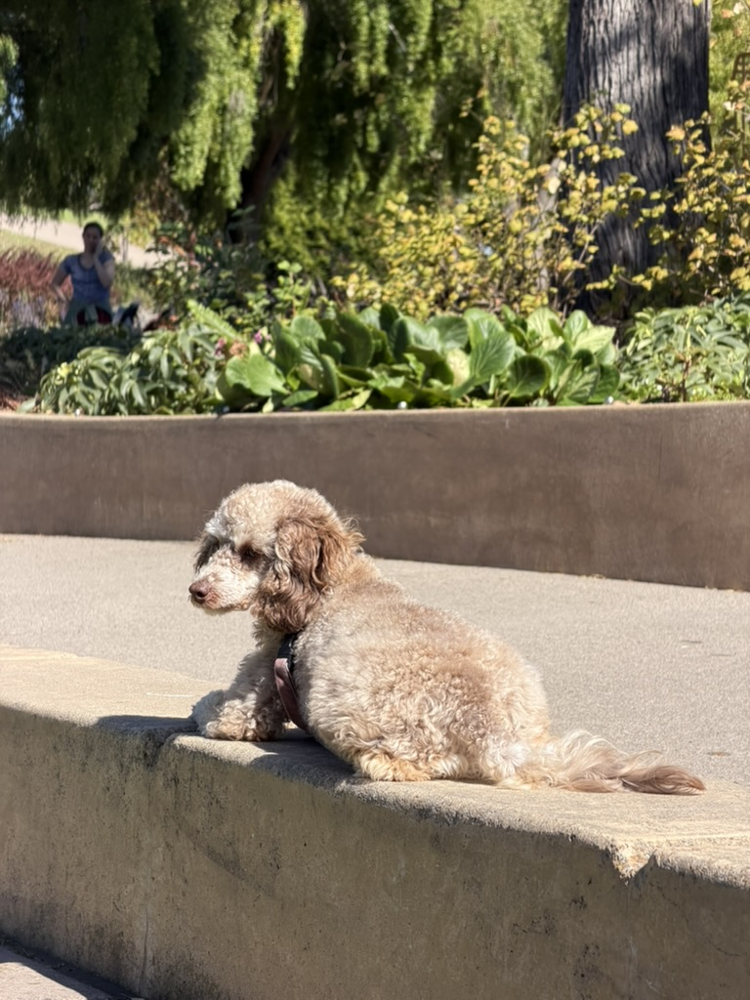

# Biscuit reference photography

This directory holds 75 reference images of Biscuit, the real miniature poodle the
platform's mascot is drawn from. They are all of the same dog, and they range from when she
was a little puppy to the grown animal she is now, gathered as reference material for
[the first pose set](../../direction.md#the-first-pose-set): the character reference sheet
that has to fix her proportions, colouring, face, ears, tail and paws before an illustrator
draws a single pose from them.

They sit in two folders, and the difference between them decides what each is worth.
`cutouts/` holds 55 iOS sticker cutouts, the subject lifted out of a photograph with the
background removed; `full/` holds 20 unaltered camera frames, background and all. The
cutouts came first and carry most of the poses; the full frames came later and carry
everything the cutouts destroyed.

Nothing here is a finished asset. The images are source material only, kept beside the
design direction they inform rather than beside the shipped icons and fonts under
`src/lib/assets/`, because they are never going to ship themselves.

Every file below has been opened and described. The index says what each one shows, what it
is good for, and what in it must not be trusted, because a reference sheet drawn from an
unread folder is how a character drifts.

## What these files are

Two sub-corpora with opposite failure modes. Read which folder a frame is in before taking
anything from it.

### The 55 cutouts

They are not raw camera frames. All 55 are 480×480 iOS sticker cutouts: the subject lifted
out of a photograph with the background removed, then exported. That has four consequences
the reference sheet has to work around.

- **The edge is the cutout's, not the animal's.** Where a leg, an ear or the tail ran past
  the edge of the source photograph, the cutout slices it flat. No cutout is a reliable
  outline, and proportion cannot be measured from any of them.
- **Two formats, and the difference matters.** 35 files are PNG and keep a live alpha
  channel, so she floats on transparency. 20 are JPEG, the same cutouts flattened onto
  **black**, which costs the floor line and the rear outline outright and collapses a brown
  dog in dim light toward a silhouette.
- **Some carry a baked-in white sticker outline** that adds several pixels to her real edge.
  Those must never be traced for the reduced icon-mark.
- **Seven pairs are one instant exported twice**, usually a PNG and its JPEG twin. Treating
  both halves of a pair as independent evidence quietly doubles the weight of seven moments.

Two of the 55 are not photographs at all, and one shows no dog. They are listed and marked
rather than deleted, because a reader who finds them unlabelled will assume they are
reference.

### The 20 full frames

These are the photographs themselves, and they come in three tiers that matter. Eleven are
phone captures at 5712 × 4284 or 4032 × 3024. Seven came through a Photos export at 768 × 1024,
one of them landscape — about a thirtieth of the pixels of the largest, so they are soft at any
magnification. Two are screen captures, softer again. Nothing has been cut out of any of them,
so they carry the four things no cutout can.

- **A real outline.** The animal ends where she ends. Thirteen of them hold her whole body
  with no limb, ear or tail touching a frame edge, which is why every claim about her
  silhouette, her tail and her feet now rests here rather than on a cutout. Being inside the
  frame is not the same as being visible: in several of them the camera's height, a table leg
  or the wall of a dog bed hides as much as an edge would have cut.
- **A floor and a background.** She stands on something, casts a shadow and sits in a room
  or a landscape, so scale, stance and how she carries herself are readable for the first
  time.
- **No sticker border and no black flatten.** Two of the three hazards that dominate the
  cutouts are simply absent.
- **Orientation intact.** Nine are portrait captures stored as landscape pixels with the
  rotation held in EXIF. Any viewer that honours EXIF shows them upright; a tool that
  strips it — which is exactly what happened to the cutouts — shows them 90 degrees off.
  Rotate before reading a pose if your tool shows one sideways.

They are not free of trouble: two were shot through a glass door, two are screen captures
rather than files, most have a harness or a collar on her, the camera is nearly always a
standing person's eye, and nineteen of the twenty show a grown dog rather than the adolescent
the sheet is anchored to.

## How to read the index

Each row gives the file, a grade, a description, tags and the moments it could serve. The
tag vocabulary is closed, so it can be searched.

| Group | Values |
| --- | --- |
| Stage | `puppy`, `juvenile`, `adolescent`, `adult` |
| Pose | `sit`, `stand`, `bipedal`, `lying`, `curled`, `sprawled`, `belly-up`, `walking`, `running`, `rolling`, `head-only`, `close-up` |
| Angle | `frontal`, `three-quarter`, `profile`, `rear-view`, `from-above` |
| Coat value | `rich-chocolate`, `mid-brown`, `faded-cafe-au-lait`, `pale-cream-cast`, `silver-beige`, `indeterminate-coat` |
| Feature legible | `liver-nose`, `amber-eyes`, `cream-markings`, `curl-texture`, `topline`, `tail-pom`, `tail-at-rest`, `head-profile`, `paw-pads`, `whole-silhouette` |
| Light | `daylight`, `indoor`, `open-shade`, `low-light`, `backlit`, `low-sun`, `blown-out`, `red-cast` |
| Hazard | `sticker-border`, `black-flatten`, `cropped-limb`, `matte-artefact`, `motion-blur`, `rotated-export`, `low-resolution`, `second-subject`, `through-glass`, `groomed-coat`, `screenshot-crop`, `camera-above`, `not-a-photo` |

The grade is how much weight a frame carries, not how good a photograph it is.

| Grade | Meaning | Count |
| --- | --- | --- |
| prime | Draw from it directly. | 31 |
| usable | Good for one thing; read the caution before taking anything else. | 40 |
| marginal | Almost nothing survives, but what does is not available elsewhere. | 1 |
| unusable | Do not draw from it at all. | 3 |

One value in the **Best for** column is not a moment: `colour-range` marks a frame that is
evidence for [the range she has to stay inside](#the-range-she-has-to-stay-inside) and for
nothing else — it shows an end of the range rather than a colour to draw.

A full frame and a cutout are not graded on the same scale by accident: a cutout graded
prime is prime for a face or a colour, and a full frame graded prime is usually prime for a
body. Where the two disagree about an outline, the full frame wins, because the cutout does
not have one.

Every hazard tag is explained under [Read these with care](#read-these-with-care), and the
things no frame answers are under
[What this corpus cannot answer](#what-this-corpus-cannot-answer).

## What is fixed

These hold across the whole corpus, at every age and in every light. They are what the
reference sheet has to lock, and each one names the mistake an illustrator makes without it.

### Liver nose, never black

The nose leather is a warm liver brown a shade or two off her body colour, with the nostrils
and philtrum reading only slightly darker and never approaching black. It is large relative to
her short muzzle and it stays brown in puppy frames, faded adolescent frames and dim frames
alike. An illustrator working from breed defaults will draw a black nose, and that single
substitution breaks the character more visibly than any proportion error.

Seen in
[biscuit-puppy-lying-sticker-outline-head-tilt](cutouts/biscuit-puppy-lying-sticker-outline-head-tilt.jpeg),
[biscuit-puppy-lying-forepaws-pads](cutouts/biscuit-puppy-lying-forepaws-pads.png),
[biscuit-adolescent-sphinx-paws-forward](cutouts/biscuit-adolescent-sphinx-paws-forward.png),
[biscuit-puppy-lying-overhead-pale-floor](cutouts/biscuit-puppy-lying-overhead-pale-floor.png),
[biscuit-adult-sit-face-study-warm-light](full/biscuit-adult-sit-face-study-warm-light.jpeg),
[biscuit-adult-stand-three-quarter-path](full/biscuit-adult-stand-three-quarter-path.jpeg).

It survives the groom, which is the strongest single argument that the two clipped frames are
her: the coat there reads silver-beige and the face is shaved, and the nose is still liver.

### Amber eyes with brown rims

The iris is light golden amber, warm and pale enough to separate from the pupil at small sizes,
and the pigment ringing the eye is liver brown rather than black, consistent with the nose. The
eyes are round and set wide on a rounded skull. The default mistake is a dark brown or black
button eye, which loses the one feature that makes her face read as hers rather than as a stock
poodle.

Seen in
[biscuit-adolescent-sphinx-paws-forward](cutouts/biscuit-adolescent-sphinx-paws-forward.png),
[biscuit-adolescent-sit-mouth-wide-open](cutouts/biscuit-adolescent-sit-mouth-wide-open.jpeg),
[biscuit-adolescent-loaf-flat-stare-2](cutouts/biscuit-adolescent-loaf-flat-stare-2.jpeg),
[biscuit-puppy-lying-forepaws-pads](cutouts/biscuit-puppy-lying-forepaws-pads.png).

This is the one fixed trait the full frames do not corroborate, and the reason is worth
recording so nobody goes looking again. In every full frame the eye carries a large reflection —
a window, a sky, a canopy — spread across the cornea, and under it the iris reads as a dark
button rather than as a ring. Only
[biscuit-adult-sit-overhead-tongue-out-chips](full/biscuit-adult-sit-overhead-tongue-out-chips.jpeg)
shows the amber at all, in the far eye, while the near one reads blue-grey from the same sky.
The amber therefore rests on the four cutouts above, and a frame that settles the iris and the
liver rim under controlled light is still missing.

### The phantom marking map and where it sits

Cream to tan sits in five fixed places and nowhere else: a band wrapping the whole muzzle from
behind the nose back under the eyes, a pair of cream pips directly above each eye, a bib on the
chest and throat, stockings from about the elbow and hock down, and cream feet. Everything else
— skull, ear leathers, back, flanks, rump — is the darker body colour. An illustrator will
otherwise paint an evenly coloured dog, or give her white feet only, and the eyebrow pips are
the piece most often dropped even though they carry the expression.

Seen in
[biscuit-puppy-lying-sticker-outline-head-tilt](cutouts/biscuit-puppy-lying-sticker-outline-head-tilt.jpeg),
[biscuit-puppy-lying-overhead-pale-floor](cutouts/biscuit-puppy-lying-overhead-pale-floor.png),
[biscuit-puppy-sprawl-overhead-forelegs-out](cutouts/biscuit-puppy-sprawl-overhead-forelegs-out.jpeg),
[biscuit-puppy-lying-forepaws-pads](cutouts/biscuit-puppy-lying-forepaws-pads.png),
[biscuit-adult-lying-overhead-topline-sunlit](full/biscuit-adult-lying-overhead-topline-sunlit.jpeg),
[biscuit-adult-side-lying-full-body-pads](full/biscuit-adult-side-lying-full-body-pads.jpeg).

The last two settle the part the cutouts could not: the back, the flanks and the rump carry no
cream at all, the stockings begin at about the elbow and the hock, and the pale hair below them
runs unbroken into the feet.

### The ear leathers are the darkest thing on her

At every age the hair on the ears is darker and warmer than the body, and as the body fades the
ears keep their brown, so adolescent frames show a near-cream dog with two clearly brown ears.
This is the single strongest defence against the cream drift the direction calls a defect. An
illustrator averaging one coat value across the whole animal will flatten the ears into the
body and lose the read entirely at icon size.

Seen in [biscuit-adolescent-run-tongue-out](cutouts/biscuit-adolescent-run-tongue-out.jpeg),
[biscuit-adolescent-walk-ball-in-mouth](cutouts/biscuit-adolescent-walk-ball-in-mouth.png),
[biscuit-adolescent-run-ears-airborne](cutouts/biscuit-adolescent-run-ears-airborne.png),
[biscuit-adolescent-stand-fish-bandana](cutouts/biscuit-adolescent-stand-fish-bandana.png),
[biscuit-adult-stand-frontal-indoor](full/biscuit-adult-stand-frontal-indoor.jpeg),
[biscuit-adult-chin-down-ears-back](full/biscuit-adult-chin-down-ears-back.jpeg).

It holds all the way to the grown dog. The body has gone paler again with age and the ear
leathers have not: they are still the one warm brown left on her.

### Low drop ears in longer, wavier hair

The ears are set low, at roughly eye level, and hang clear of the cheek as two distinct lobes
reaching about to the jawline, covered in longer and looser waves than the tighter curl of the
body. They swing and lift independently when she moves. The default errors are a high ear set,
a short ear, or ears drawn in the same curl texture as the body, all of which square off a head
that is round in every frame.

Seen in
[biscuit-adolescent-sphinx-paws-forward](cutouts/biscuit-adolescent-sphinx-paws-forward.png),
[biscuit-adolescent-sit-mouth-wide-open](cutouts/biscuit-adolescent-sit-mouth-wide-open.jpeg),
[biscuit-adolescent-stand-overhead-rear-2](cutouts/biscuit-adolescent-stand-overhead-rear-2.jpeg),
[biscuit-puppy-sit-head-turned](cutouts/biscuit-puppy-sit-head-turned.png),
[biscuit-adult-lying-profile-ledge-tail-out](full/biscuit-adult-lying-profile-ledge-tail-out.jpeg),
[biscuit-adult-sit-face-study-warm-light](full/biscuit-adult-sit-face-study-warm-light.jpeg).

### Short blunt muzzle on a domed skull

The muzzle is short and blunt with a soft stop, and the skull above it is domed and round, so
the whole head reads as a circle with a stub on the front rather than as a wedge. This holds
from puppy through adolescent frames, and in both of the profiles the corpus has. An illustrator
reaching for the long tapering show-poodle head will lengthen the muzzle and narrow the skull,
which ages her and makes her elegant, and she is neither.

Seen in
[biscuit-adolescent-sphinx-paws-forward](cutouts/biscuit-adolescent-sphinx-paws-forward.png),
[biscuit-adolescent-loaf-flat-stare](cutouts/biscuit-adolescent-loaf-flat-stare.png),
[biscuit-adolescent-profile-head-red-filter](cutouts/biscuit-adolescent-profile-head-red-filter.jpeg),
[biscuit-adolescent-sit-mouth-wide-open](cutouts/biscuit-adolescent-sit-mouth-wide-open.jpeg),
[biscuit-adult-lying-profile-ledge-tail-out](full/biscuit-adult-lying-profile-ledge-tail-out.jpeg).

The ledge frame is the only side view of her head with its colour intact, and it agrees with
the red one: a short stub on a circle, with the stop soft enough to be a curve rather than an
angle.

### Unclipped coat, soft irregular waves

She is never groomed to a pattern. The coat is soft, open, slightly irregular waves and loose
curls, longest on the skull as a shapeless topknot and on the ears and legs, with no clipped
line anywhere — the face is not shaved, the feet are not shaved, and there are no bracelets or
rosettes. The default mistake is the continental show trim, which is what a generic reference
for the word poodle returns and which would put a barbered dog inside a workshop that is
supposed to hold exactly one soft thing.

Seen in
[biscuit-puppy-lying-sticker-outline-head-tilt](cutouts/biscuit-puppy-lying-sticker-outline-head-tilt.jpeg),
[biscuit-adolescent-loaf-flat-stare](cutouts/biscuit-adolescent-loaf-flat-stare.png),
[biscuit-adolescent-run-tongue-out](cutouts/biscuit-adolescent-run-tongue-out.jpeg),
[biscuit-adolescent-stand-overhead-topline](cutouts/biscuit-adolescent-stand-overhead-topline.png),
[biscuit-adult-lying-redwood-duff-head-up](full/biscuit-adult-lying-redwood-duff-head-up.jpeg),
[biscuit-adult-stand-three-quarter-path](full/biscuit-adult-stand-three-quarter-path.jpeg).

Two frames are the exception rather than a contradiction: in
[biscuit-adult-sit-groomed-balcony-through-glass](full/biscuit-adult-sit-groomed-balcony-through-glass.jpeg)
and [biscuit-adult-head-close-groomed-park](full/biscuit-adult-head-close-groomed-park.jpeg)
she has been clipped short with a rounded topknot and a tidied face. That is a groomer's
decision on a particular week, not her coat, and nothing on the sheet should be drawn from it.

### Tail carries a paler plume

The tail ends in a fuller, longer, distinctly paler tuft of hair than the shaft or the body
carries, visible from above at rest and streaming behind her at a run. It is a plume, not a
bare whip and not a shaved pom on a clipped stalk. An illustrator will otherwise draw either
the show-trim pom on a naked tail or a smooth tapered tail, and both contradict the unclipped
coat above.

Seen in
[biscuit-puppy-sprawl-overhead-forelegs-out](cutouts/biscuit-puppy-sprawl-overhead-forelegs-out.jpeg),
[biscuit-adolescent-stand-overhead-rear-2](cutouts/biscuit-adolescent-stand-overhead-rear-2.jpeg),
[biscuit-adolescent-run-grass-tail-streaming](cutouts/biscuit-adolescent-run-grass-tail-streaming.png),
[biscuit-adolescent-loaf-flat-stare-2](cutouts/biscuit-adolescent-loaf-flat-stare-2.jpeg).

### The tail is long, and its carriage follows the pose

The full frames settle a thing the cutouts could not, because none of them held a whole tail.
It is long and feathered along its whole length rather than only at the tip, and it is carried
two ways, decided by what the rest of her is doing rather than by mood. Standing she carries it
up and curved above the line of the back, the plume falling to one side. Sitting or lying she
lays it out behind her along the ground, straight or in a shallow curve, and it goes slack. None
of the full frames shows it tucked between her legs, so a cowed carriage is not attested
anywhere in this folder. Every full frame of the carriage is a standing or a resting dog; what
it does on the move is recorded only in the run cutouts, streaming out behind her.

Seen at rest in
[biscuit-adult-lying-profile-ledge-tail-out](full/biscuit-adult-lying-profile-ledge-tail-out.jpeg)
and
[biscuit-adult-lying-rear-view-park-blanket](full/biscuit-adult-lying-rear-view-park-blanket.jpeg);
carried up in
[biscuit-adult-stand-three-quarter-path](full/biscuit-adult-stand-three-quarter-path.jpeg),
[biscuit-adult-stand-blanket-jaws-open](full/biscuit-adult-stand-blanket-jaws-open.jpeg)
and
[biscuit-adult-stand-balcony-through-glass](full/biscuit-adult-stand-balcony-through-glass.jpeg).

### Dark pads under cream foot feathering

The pads are dark slate to charcoal brown and the hair over and between the toes is cream, so
from above and from the side the foot reads as a pale mop and the dark only appears when the
sole turns to the camera. The default mistake is pink pads, or a clipped poodle foot with the
toes exposed, either of which contradicts the marking map and the unclipped coat.

Seen in [biscuit-puppy-lying-forepaws-pads](cutouts/biscuit-puppy-lying-forepaws-pads.png),
[biscuit-puppy-lying-overhead-pale-floor](cutouts/biscuit-puppy-lying-overhead-pale-floor.png),
[biscuit-puppy-sprawl-overhead-forelegs-out](cutouts/biscuit-puppy-sprawl-overhead-forelegs-out.jpeg),
[biscuit-adolescent-belly-up-sunlit-harness](cutouts/biscuit-adolescent-belly-up-sunlit-harness.png),
[biscuit-adult-side-lying-full-body-pads](full/biscuit-adult-side-lying-full-body-pads.jpeg).

The last of those is the first grown foot in the folder and the only frame that shows three at
once: both forefeet and one hind foot, soles turned to the camera on a lit floor, dark against
the cream feathering, with black nails coming through the hair. The far hind foot is underneath
her. Everything the sheet says about her feet rested on puppy frames until it arrived.

Two of these are worth stating twice, because they are the ones a generic poodle reference
overrides: **the nose is liver brown, not black**, and **the eyes are amber, not dark**.

## What varies, and must be chosen

These change across the corpus. Averaging them produces a dog that appears in no photograph,
so each has to be decided once and then held.

### Body coat value

Her body value travels the whole way from deep saturated chocolate as a puppy to a greyish
café-au-lait as an adolescent, and the grown frames sit at that same faded end rather than past
it: a pale biscuit cream with the ears still brown. Several bright-daylight frames push further
into something that reads white, and two clipped frames read silver-beige, and neither is her.
This must be chosen, not averaged, and the direction settles which way: recognisably brown
points at the dark end. Take the puppy chocolate as the reference value, treat the café-au-lait
loaf as the absolute lightest she is ever permitted to be drawn, and treat every pale-cream-cast
frame as an exposure artefact that carries no colour information at all.

The grown frames looked at first as though they extended the range. Read by capture date they do
not, and [the range she has to stay inside](#the-range-she-has-to-stay-inside) shows why.

Ends:
[biscuit-puppy-lying-sticker-outline-head-tilt](cutouts/biscuit-puppy-lying-sticker-outline-head-tilt.jpeg)
against [biscuit-adolescent-loaf-flat-stare](cutouts/biscuit-adolescent-loaf-flat-stare.png).

### Contrast between body and markings

The marking pattern is fixed but its legibility is not. In the puppy frames the cream mask, bib
and stockings cut hard against the body; in the faded adolescent frames the same marks barely
separate and the dog reads as one tone with slightly darker ears. Because the reduced icon-mark
has to work at sixteen pixels, the sheet must pick a body value dark enough that the mask and
the stockings still read as marks and not as shading.

Ends: [biscuit-puppy-lying-forepaws-pads](cutouts/biscuit-puppy-lying-forepaws-pads.png)
against [biscuit-adolescent-loaf-flat-stare](cutouts/biscuit-adolescent-loaf-flat-stare.png).

### Coat length and groom state

She appears both long and shaggy, with the waves loose enough to break up her outline, and
freshly short, with the curl tight against the body and the silhouette clean. Neither is wrong
and the two produce visibly different animals, so one has to be named and held. The shaggier
end is funnier and reads more clearly as unclipped; the shorter end gives the icon-mark a
silhouette it can survive at small size.

The two groomed frames are the far end of the short reading, and they show what it costs: a
clipped face and a rounded topknot turn her into a poodle in general rather than into her, and
the value goes with it. They are the argument for the shaggy end rather than against it.

Ends:
[biscuit-puppy-lying-sticker-outline-head-tilt](cutouts/biscuit-puppy-lying-sticker-outline-head-tilt.jpeg)
against
[biscuit-adolescent-run-ears-airborne](cutouts/biscuit-adolescent-run-ears-airborne.png),
with the clipped extreme at
[biscuit-adult-sit-groomed-balcony-through-glass](full/biscuit-adult-sit-groomed-balcony-through-glass.jpeg).

### Ear hair length

Puppy ears are short and sit close to the head; adolescent ears carry long wavy hair that hangs
well below the jaw and flies clear of the skull at a run. Since the ears are the trait the mark
is most likely to be built from, their length is a decision with consequences beyond the face
and cannot be left to the individual pose.

Ends:
[biscuit-puppy-lying-sticker-outline-frontal](cutouts/biscuit-puppy-lying-sticker-outline-frontal.png)
against [biscuit-adolescent-run-tongue-out](cutouts/biscuit-adolescent-run-tongue-out.jpeg).

### Head-to-body proportion by age

The puppy frames give an oversized head on a short-legged body; the adolescent frames give
adult proportions on a leggy frame with a longer muzzle; the grown frames give a heavier,
deeper, shorter-legged animal under a longer coat. The corpus tempts a blend because the colour
evidence is strongest in the puppy frames and the readable whole bodies are all in the grown
ones, and a blend produces a dog that exists in no photograph. Name one age, take proportion
only from that age, and let the other ages inform colour and behaviour alone.

This is the sharpest trap the full frames introduce. They are the only frames in the folder
that hold a complete uncut animal, so they are the obvious place to measure from — and the
sheet is anchored to the adolescent, which is not the age they show. Read stance, tail, feet
and marking map from them; do not read leg length or body depth from them.

Ends: [biscuit-puppy-lying-forepaws-pads](cutouts/biscuit-puppy-lying-forepaws-pads.png)
against [biscuit-adolescent-run-tongue-out](cutouts/biscuit-adolescent-run-tongue-out.jpeg),
with the grown build at
[biscuit-adult-side-lying-full-body-pads](full/biscuit-adult-side-lying-full-body-pads.jpeg).

### Whether the eyes clear the fringe

In some frames the topknot falls over the brow and the eyes are entirely veiled, leaving only
the muzzle and nose to carry the face; in others the hair is back and both amber eyes hold the
lens. One face learned by heart cannot have it both ways. The open-eyed read is the one that
supports a fixed face and a rare break, and the veiled frames are then available as a
deliberate state rather than as a drawing variation.

Ends:
[biscuit-juvenile-head-lowered-curls-over-eyes](cutouts/biscuit-juvenile-head-lowered-curls-over-eyes.jpeg)
against
[biscuit-adolescent-sphinx-paws-forward](cutouts/biscuit-adolescent-sphinx-paws-forward.png).

### The range she has to stay inside

The direction states that she "stays recognisably brown" and that "drifting toward cream or
white is a defect, not a variation". The corpus makes that a live risk rather than a
theoretical one: her body value travels the whole way from the chocolate on the left to the
café-au-lait on the right, and hard sun pushes several frames past the right-hand end into
something that reads cream.

Left is the reference value. Right is the lightest she may ever be drawn. Anything paler in
this folder is the exposure, not the dog.

The grown frames looked at first as though they moved that right-hand end, and they do not.
Read by capture date rather than by eye, they say the opposite. The one silver-beige frame,
[biscuit-adult-sit-groomed-balcony-through-glass](full/biscuit-adult-sit-groomed-balcony-through-glass.jpeg),
is the **oldest** adult photograph in the folder — December 2025, with the tree over the parapet
still in autumn yellow — and it is a freshly clipped dog behind a glass door with a panel seam
running down her body. The controlled comparison is
[biscuit-adult-stand-balcony-through-glass](full/biscuit-adult-stand-balcony-through-glass.jpeg):
the same balcony, the same glass, seven months later, unclipped, and she reads cream-tan with
clearly brown ears. The genuinely newest frames in the folder run to August 2026 and sit at the
café-au-lait end, not past it.

So there is no continuing fade to decide about. The pale readings in this folder are a groom, a
pane of glass and hard sun, in that order, and the rule the direction states holds without
amendment.

## The index

Seventy-five files, grouped by age and then by grade. The second line of each description is
the thing that frame must not be trusted for. Which folder a frame is in, and therefore which
set of hazards applies, follows from its group: everything under Puppy, Juvenile and
Adolescent is a cutout except the one red-cast frame marked as a full frame, and everything
under Adult is a full frame.

12 puppy, 13 juvenile, 31 adolescent, 19 adult. Her age in a frame is the owner's call, not a
reading of the pixels, and where the two disagreed the owner won.

### Puppy

The colour evidence lives here. Every frame but the silhouette is rich chocolate at full
marking contrast, all of it shot indoors or in low light, and the only closed eyes in the
cutouts are in this group.

| Photo | Grade | What it shows | Tags | Best for |
| --- | --- | --- | --- | --- |
| [biscuit-puppy-asleep-head-down](cutouts/biscuit-puppy-asleep-head-down.jpeg) | prime | Asleep with her head down on a surface, eyes shut, liver nose and cream muzzle filling the frame. _Only the head is in frame, so nothing here fixes proportion._ | lying, eyes-closed, head-only, puppy, rich-chocolate, liver-nose, black-flatten, indoor | sleepy, colour-reference |
| [biscuit-puppy-curled-lamb-toy-bed](cutouts/biscuit-puppy-curled-lamb-toy-bed.jpeg) | prime | Puppy lying in a sheepskin bed with her chin over a lamb toy, looking straight at the camera. | curled, lying, dog-bed, plush-toy, eye-contact, puppy, rich-chocolate, black-flatten | face-reference, colour-reference, sleepy |
| [biscuit-puppy-lying-forepaws-pads](cutouts/biscuit-puppy-lying-forepaws-pads.png) | prime | Puppy lying with both forepaws thrown at the lens, chin low, dark pads showing under cream feathering. _Everything behind the shoulders leaves the frame, so proportion is not readable._ | lying, frontal, puppy, rich-chocolate, liver-nose, amber-eyes, paw-pads, indoor | face-reference, colour-reference, idle |
| [biscuit-puppy-lying-overhead-pale-floor](cutouts/biscuit-puppy-lying-overhead-pale-floor.png) | prime | Puppy lying flat on a pale floor, forelegs stretched out, head lifted almost square to a camera above. | lying, from-above, eye-contact, puppy, rich-chocolate, cream-markings, clean-cutout, indoor | face-reference, colour-reference, idle |
| [biscuit-puppy-lying-sticker-outline-frontal](cutouts/biscuit-puppy-lying-sticker-outline-frontal.png) | prime | Puppy lying square to the lens with both cream forepaws forward, inside a thick white sticker outline. _The baked-in white outline thickens her true silhouette._ | lying, frontal, puppy, rich-chocolate, sticker-border, liver-nose, amber-eyes, indoor | face-reference, colour-reference, mark-silhouette, arrival |
| [biscuit-puppy-lying-sticker-outline-head-tilt](cutouts/biscuit-puppy-lying-sticker-outline-head-tilt.jpeg) | prime | Puppy lying with her forepaws stretched forward and her head tilted, inside a thick white sticker outline. _The baked-in white outline thickens her true silhouette._ | lying, three-quarter, head-tilt, puppy, rich-chocolate, sticker-border, liver-nose, cream-markings | colour-reference, face-reference, idle |
| [biscuit-puppy-sit-head-turned](cutouts/biscuit-puppy-sit-head-turned.png) | prime | A chocolate puppy sits square to the camera, cream chin and tan feet, looking just past the lens. _The baked-in white outline thickens her true silhouette._ | sit, three-quarter, puppy, rich-chocolate, cream-markings, liver-nose, sticker-border, indoor | face-reference, colour-reference, idle |
| [biscuit-puppy-sit-looking-up](cutouts/biscuit-puppy-sit-looking-up.png) | prime | Puppy sitting square and looking straight up, cream muzzle bright against a deep chocolate head. _The top of her skull and both ear tips are sliced off by the frame._ | sit, frontal, eye-contact, puppy, rich-chocolate, liver-nose, amber-eyes, cropped-limb | face-reference, arrival, colour-reference |
| [biscuit-puppy-sprawl-overhead-forelegs-out](cutouts/biscuit-puppy-sprawl-overhead-forelegs-out.jpeg) | prime | Sprawled flat on her front from directly above, forelegs stretched out, amber eyes angled up at the lens. | sprawled, from-above, eye-contact, puppy, rich-chocolate, cream-markings, tail-pom, black-flatten | idle, face-reference, colour-reference |
| [biscuit-puppy-belly-up-mouth-open](cutouts/biscuit-puppy-belly-up-mouth-open.png) | usable | Puppy on her back from above, running diagonally across the frame, mouth open, collar tag catching light. _Shadow crushes the body and the hind feet are sliced flat at the frame edge._ | belly-up, from-above, mouth-open, collar, puppy, rich-chocolate, low-light, cropped-limb | idle, win |
| [biscuit-puppy-side-lying-head-up](cutouts/biscuit-puppy-side-lying-head-up.png) | usable | Puppy on her side with her head tipped up, cream chest taking the only light, rump out of frame. _The body is near-black and an orange fringe survives along the cutout edge._ | lying, from-above, puppy, rich-chocolate, cream-markings, amber-eyes, low-light, cropped-limb | sleepy, idle |
| [biscuit-puppy-bipedal-silhouette](cutouts/biscuit-puppy-bipedal-silhouette.jpeg) | marginal | Near-silhouette of her standing upright on her hind legs in profile, forelegs bent at her chest. _Only the outline survives the black flatten; nothing here carries colour or face._ | bipedal, profile, silhouette, low-light, black-flatten, indeterminate-coat, low-resolution, small-in-frame | mark-silhouette |

### Juvenile

The weakest group, and the only one holding no prime frame at all. The coat is on the turn,
every frame is indoors, dim or under a red cast, and much of it has clothing in the way.

| Photo | Grade | What it shows | Tags | Best for |
| --- | --- | --- | --- | --- |
| [biscuit-juvenile-belly-up-bare-belly](cutouts/biscuit-juvenile-belly-up-bare-belly.png) | usable | On her back seen from directly above, legs splayed, belly fur thin enough to show the skin underneath. _A flat white notch of unremoved background sits beside the left hind leg._ | belly-up, sprawled, from-above, indoor, mid-brown, matte-artefact, juvenile, thin-belly-fur | sleepy, idle |
| [biscuit-juvenile-belly-up-dim-floor](cutouts/biscuit-juvenile-belly-up-dim-floor.png) | usable | Flat on her back on a dark floor, limbs dropped outward, head lolled back, shot from directly above. _The frame is dim and grainy, so the eyes are not readable._ | belly-up, sprawled, from-above, low-light, mid-brown, sticker-border, low-resolution, juvenile | sleepy, mark-silhouette, idle |
| [biscuit-juvenile-belly-up-forelegs-folded](cutouts/biscuit-juvenile-belly-up-forelegs-folded.png) | usable | On her back with her head tipped away, one amber eye open, cream forelegs folded over a bare belly. _The hindquarters are sliced flat at the frame edge, so proportion is not readable._ | belly-up, from-above, rich-chocolate, cream-markings, liver-nose, amber-eyes, indoor, cropped-limb | colour-reference, sleepy |
| [biscuit-juvenile-chin-on-paws-red-cast](cutouts/biscuit-juvenile-chin-on-paws-red-cast.png) | usable | Lying with her chin down between both forepaws beside a folded blanket, the whole frame flooded red. _The red flood makes coat and eye colour unrecoverable; only the marking pattern separates._ | lying, head-down, red-cast, blanket, indeterminate-coat, cropped-limb, matte-artefact, juvenile | sleepy |
| [biscuit-juvenile-curled-underexposed-head-low](cutouts/biscuit-juvenile-curled-underexposed-head-low.jpeg) | usable | Curled with her head lowered to the camera, near-black as delivered, cream mask and forepaws recoverable. _As delivered it reads far darker than she is; lift the tone before taking any coat value._ | curled, lying, low-light, black-flatten, sticker-border, cropped-limb, mid-brown, liver-nose | loss, sleepy |
| [biscuit-juvenile-head-down-dim-profile](cutouts/biscuit-juvenile-head-down-dim-profile.png) | usable | Lying with her head down and turned aside, muzzle in profile, the room too dark to hold her body. _Underexposure loses the body and any reliable colour._ | lying, profile, head-down, low-light, indeterminate-coat, sticker-border, matte-artefact, juvenile | sleepy, sign-off |
| [biscuit-juvenile-head-lowered-curls-over-eyes](cutouts/biscuit-juvenile-head-lowered-curls-over-eyes.jpeg) | usable | Head lowered and shot from above, chocolate curls falling across the eyes, cream muzzle and liver nose lit. _Hair veils both eyes and there is no body here to judge proportion from._ | head-only, from-above, rich-chocolate, liver-nose, cream-markings, sticker-border, indoor, eyes-veiled | colour-reference, sleepy |
| [biscuit-juvenile-side-lying-hand-on-ribs](cutouts/biscuit-juvenile-side-lying-hand-on-ribs.png) | usable | Lying on her side in sock-monkey booties, a striped toy at her mouth, a hand pressing her ribs. _A human forearm crosses the torso and booties hide every paw._ | lying, profile, booties, human-hand, toy-in-mouth, indoor, rich-chocolate, cream-markings | sleepy, colour-reference |
| [biscuit-juvenile-sit-rear-pink-collar](cutouts/biscuit-juvenile-sit-rear-pink-collar.png) | usable | Exported upside down; turned upright she sits with her back to the lens, head tipped, pink buckled collar showing. _The file sits 180 degrees off and the face is absent, so do not read the pose as delivered._ | sit, rear-view, rotated-export, collar, low-light, matte-artefact, mid-brown, no-face | sign-off |
| [biscuit-juvenile-sprawl-profile-booties](cutouts/biscuit-juvenile-sprawl-profile-booties.jpeg) | usable | Sprawled in profile against flat black, hind legs kicked back, booties on every visible paw. _The rear merges into the black flatten and the tail cannot be picked out at all._ | sprawled, profile, booties, low-light, black-flatten, rich-chocolate, topline, juvenile | sleepy, idle |
| [biscuit-juvenile-cartoon-head-on-keyboard](cutouts/biscuit-juvenile-cartoon-head-on-keyboard.png) | unusable | A flat cel-shaded cartoon of a curly poodle head tipped against a laptop keyboard, heavy black outline. _Not a photograph: every proportion and colour here is the illustrator's invention._ | not-a-photo, illustration, head-only, laptop, sticker-border, indoor, indeterminate-coat, reject | none |
| [biscuit-juvenile-cartoon-peeking-over-laptop](cutouts/biscuit-juvenile-cartoon-peeking-over-laptop.png) | unusable | A cel-shaded cartoon poodle rests her chin and forepaws on an open laptop; this is a drawing. _Not a photograph: the drawn eyes are dark, contradicting her amber ground truth._ | not-a-photo, illustration, head-only, laptop, sticker-border, indoor, indeterminate-coat, reject | none |
| [biscuit-juvenile-legs-only-sock-monkey-socks](cutouts/biscuit-juvenile-legs-only-sock-monkey-socks.png) | unusable | Close-up of two legs in grey sock-monkey dog socks, red rubber grip pads turned to the camera. _The socks cover both paws and no head or body is in frame._ | close-up, socks, no-face, cropped-limb, indoor, indeterminate-coat, paws-covered, reject | none |

### Adolescent

The pose evidence lives here — running, rearing, rolling and loafing — and so does the fade. It
is the only group of cutouts shot in daylight, which is exactly why its coat values are the
least trustworthy of them.

| Photo | Grade | What it shows | Tags | Best for |
| --- | --- | --- | --- | --- |
| [biscuit-adolescent-bipedal-looking-up](cutouts/biscuit-adolescent-bipedal-looking-up.png) | prime | Reared on her hind legs and looking up at the lens, patterned harness across the chest. _The harness hides the chest and topline._ | bipedal, from-above, eye-contact, harness, daylight, pale-cream-cast, liver-nose, amber-eyes | arrival, long-absence, face-reference |
| [biscuit-adolescent-loaf-flat-stare](cutouts/biscuit-adolescent-loaf-flat-stare.png) | prime | Loafed with her legs tucked and her head up, looking flat into the lens from slightly above. _Both ears are clipped by the frame and a dark patch of background survives at lower left._ | curled, frontal, eye-contact, faded-cafe-au-lait, liver-nose, amber-eyes, indoor, matte-artefact | face-reference, colour-reference, idle |
| [biscuit-adolescent-loaf-flat-stare-2](cutouts/biscuit-adolescent-loaf-flat-stare-2.jpeg) | prime | The same loaf flattened onto black: curled on the floor, looking straight up into the lens. _The black flatten swallows the floor line and part of her rear outline._ | curled, frontal, eye-contact, faded-cafe-au-lait, liver-nose, amber-eyes, indoor, black-flatten | face-reference, colour-reference, idle |
| [biscuit-adolescent-lying-grass-teeth-showing-2](cutouts/biscuit-adolescent-lying-grass-teeth-showing-2.jpeg) | prime | The same moment, tighter and brighter: head lifted from the grass, mouth open, ears splayed wide. _A dark second animal at right sinks into the black flatten and eats her rear outline._ | lying, frontal, grass, mouth-open, eye-contact, mid-brown, black-flatten, second-subject | win, arrival, face-reference |
| [biscuit-adolescent-lying-plush-toy](cutouts/biscuit-adolescent-lying-plush-toy.png) | prime | Lying behind a plush toy pressed to her chest, harness on, tongue tip out, staring at the camera. _The crown is shaved flat by the top edge and a black halo rings part of the cutout._ | lying, three-quarter, plush-toy, harness, tongue-out, eye-contact, daylight, pale-cream-cast | face-reference, arrival |
| [biscuit-adolescent-run-ears-airborne](cutouts/biscuit-adolescent-run-ears-airborne.png) | prime | Running straight at the camera with both ears lifted clear of her head and her mouth open. _The near foreleg is sliced at the bottom edge and the ear flaps carry motion smear._ | running, frontal, ears-flying, mouth-open, eye-contact, daylight, pale-cream-cast, motion-blur | arrival, win |
| [biscuit-adolescent-run-tongue-out](cutouts/biscuit-adolescent-run-tongue-out.jpeg) | prime | Running at the camera with ears flying and tongue out, harness on, flattened onto black. _The ear tips and forelegs carry motion smear._ | running, frontal, ears-flying, tongue-out, harness, daylight, faded-cafe-au-lait, black-flatten | arrival, win, face-reference |
| [biscuit-adolescent-sit-mouth-wide-open](cutouts/biscuit-adolescent-sit-mouth-wide-open.jpeg) | prime | Looking up into the lens with her mouth wide open, tongue down, collar tags catching the light. _Everything below the chest is inferred, and a green grass fringe clings to the left ear._ | sit, frontal, mouth-open, eye-contact, collar, daylight, faded-cafe-au-lait, black-flatten | win, face-reference |
| [biscuit-adolescent-sit-pink-heart-collar](cutouts/biscuit-adolescent-sit-pink-heart-collar.jpeg) | prime | Sitting square to the lens and looking up, pink heart collar and harness on, cream body with tan ears. _The baked-in white outline thickens her true silhouette._ | sit, frontal, eye-contact, collar, harness, sticker-border, indoor, pale-cream-cast | face-reference, arrival, idle |
| [biscuit-adolescent-sit-pink-heart-collar-2](cutouts/biscuit-adolescent-sit-pink-heart-collar-2.png) | prime | The same sit, wider: pink collar and harness, looking straight up, forelegs braced below her. _The baked-in white outline thickens her true silhouette._ | sit, from-above, eye-contact, collar, harness, sticker-border, pale-cream-cast, cropped-limb | arrival, face-reference, colour-reference |
| [biscuit-adolescent-sphinx-paws-forward](cutouts/biscuit-adolescent-sphinx-paws-forward.png) | prime | Lying sphinx-style with both forelegs stretched at the lens, head up, holding direct eye contact. _The hindquarters sit outside the frame and the near foreleg is cut at the bottom._ | lying, frontal, eye-contact, collar, daylight, faded-cafe-au-lait, sticker-border, cropped-limb | face-reference, colour-reference, idle |
| [biscuit-adolescent-trot-overhead-tongue-out](cutouts/biscuit-adolescent-trot-overhead-tongue-out.jpeg) | prime | Trotting up at the camera from above, tongue out, harness on, the body reading cream in hard daylight. _Bright sun lifts the coat toward cream, so this frame overstates how pale she is._ | walking, from-above, tongue-out, harness, daylight, faded-cafe-au-lait, sticker-border, black-flatten | face-reference, arrival |
| [biscuit-adolescent-walk-ball-in-mouth](cutouts/biscuit-adolescent-walk-ball-in-mouth.png) | prime | Walking straight at the camera with a blue-and-orange ball in her mouth, body cream throughout, one ear still brown. _Her hind feet meet the bottom edge, so leg length cannot be measured from this frame._ | walking, frontal, ball, harness, eye-contact, daylight, pale-cream-cast, adolescent | arrival, win, face-reference, colour-reference |
| [biscuit-adolescent-back-roll-open-mouth](cutouts/biscuit-adolescent-back-roll-open-mouth.jpeg) | usable | Sideways in the export: shot from above, she lies on her back mid-roll, limbs splayed, mouth open. _The export sits sideways and the source frame slices limbs flat on three sides._ | belly-up, rolling, from-above, mouth-open, rotated-export, black-flatten, cropped-limb, faded-cafe-au-lait | idle, win |
| [biscuit-adolescent-back-roll-open-mouth-2](cutouts/biscuit-adolescent-back-roll-open-mouth-2.jpeg) | usable | The same roll, wider crop: head thrown back, mouth open on a white canine, one forepaw over her muzzle. _The export sits sideways, the face is blurred, and the chin and two limbs are sliced flat._ | belly-up, rolling, from-above, mouth-open, rotated-export, black-flatten, motion-blur, faded-cafe-au-lait | win, idle |
| [biscuit-adolescent-belly-up-sunlit-harness](cutouts/biscuit-adolescent-belly-up-sunlit-harness.png) | usable | Upside down in the export: on her back in bright sun, harness still on, legs dropped outward. _Sun flares the one visible eye pale blue-grey; her eyes are amber, not this._ | belly-up, sprawled, from-above, rotated-export, harness, daylight, faded-cafe-au-lait, matte-artefact | win, idle, colour-reference |
| [biscuit-adolescent-bipedal-jaws-open](cutouts/biscuit-adolescent-bipedal-jaws-open.png) | usable | Up on her hind legs in a pink harness, jaws open and her head thrown back. _The near hind leg is sliced off at the frame edge, so proportion is unreliable._ | bipedal, three-quarter, harness, mouth-open, daylight, faded-cafe-au-lait, cropped-limb, matte-artefact | win, arrival |
| [biscuit-adolescent-chin-down-party-hat](cutouts/biscuit-adolescent-chin-down-party-hat.jpeg) | usable | Wearing a paw-print party hat with green trim, she lies chin down and looks up without moving. _The black flatten and edge fringing make the body outline unreliable._ | lying, frontal, party-hat, head-down, eye-contact, mid-brown, black-flatten, indoor | loss, long-absence, face-reference |
| [biscuit-adolescent-head-on-blanket-red-cast](cutouts/biscuit-adolescent-head-on-blanket-red-cast.png) | usable | Head down on a blanket, three-quarter from her left, the near eye open with a windowpane catchlight. _The red flood destroys colour outright; take structure from this frame, never value._ | lying, head-down, close-up, red-cast, indeterminate-coat, cropped-limb, matte-artefact, adolescent | sleepy, idle |
| [biscuit-adolescent-lying-grass-teeth-showing](cutouts/biscuit-adolescent-lying-grass-teeth-showing.png) | usable | Lying low in grass with her head to the camera and her mouth open on her lower teeth. _An unremoved dark second animal corrupts the right edge and her rear outline._ | lying, three-quarter, grass, mouth-open, eye-contact, daylight, mid-brown, second-subject | colour-reference, loss |
| [biscuit-adolescent-profile-head-red-filter](cutouts/biscuit-adolescent-profile-head-red-filter.jpeg) | usable | Profile head study rendered in flat saturated red on black, curl structure and muzzle line intact. _The red filter destroys every coat and eye colour in the frame._ | head-only, profile, red-cast, black-flatten, indeterminate-coat, cropped-limb, sharp-detail, adolescent | face-reference, mark-silhouette |
| [biscuit-adolescent-run-grass-tail-streaming](cutouts/biscuit-adolescent-run-grass-tail-streaming.png) | usable | Running over grass at full stride, mouth open, ears blown back, tail streaming behind her. _Hard sun pushes the coat near-white; the value here is the light, not her colour._ | running, from-above, ears-flying, mouth-open, blown-out, faded-cafe-au-lait, matte-artefact, cropped-limb | arrival, win |
| [biscuit-adolescent-sit-pink-sweater](cutouts/biscuit-adolescent-sit-pink-sweater.png) | usable | Sitting upright in a pink knit sweater, forelegs splayed forward, the face small and soft in the frame. _The knit sweater shapes the torso, so the body under it is not hers to draw._ | sit, frontal, sweater, daylight, mid-brown, low-resolution, matte-artefact, adolescent | idle |
| [biscuit-adolescent-sit-pink-sweater-2](cutouts/biscuit-adolescent-sit-pink-sweater-2.jpeg) | usable | The same sit flattened onto black: pink knit sweater, hind legs sprawled forward, eyes lost under the fringe. _Underexposure hides the eyes and the sweater hides the torso._ | sit, frontal, sweater, low-light, mid-brown, black-flatten, eyes-obscured, matte-artefact | idle, sleepy |
| [biscuit-adolescent-stand-fish-bandana](cutouts/biscuit-adolescent-stand-fish-bandana.png) | usable | Standing head-lowered in a fish-print bandana and harness, face soft, rear sliced flat by the frame. _Bright light washes the legs and chest toward white while the head stays tan._ | stand, three-quarter, bandana, harness, head-lowered, faded-cafe-au-lait, sticker-border, cropped-limb | sleepy, loss, colour-reference |
| [biscuit-adolescent-stand-low-sun-head-turned](cutouts/biscuit-adolescent-stand-low-sun-head-turned.png) | usable | Standing in low sun with her body angled away and her head brought round to the camera, tilted. _Low front sun gilds her chest pale gold, so the value here is the light and not the coat._ | stand, three-quarter, backlit, low-sun, indeterminate-coat, low-resolution, cropped-limb, adolescent | mark-silhouette, face-reference |
| [biscuit-adolescent-stand-low-sun-head-turned-2](cutouts/biscuit-adolescent-stand-low-sun-head-turned-2.png) | usable | The same low-sun stand, softer and larger: body angled away, head brought round and tilted to the camera. _Warm sun gilds the lit side gold while the shade reads mid-brown; neither value is trustworthy._ | stand, three-quarter, backlit, low-sun, indeterminate-coat, low-resolution, matte-artefact, adolescent | face-reference, mark-silhouette |
| [biscuit-adolescent-stand-overhead-rear](cutouts/biscuit-adolescent-stand-overhead-rear.png) | usable | Seen from above and behind as she stands, crown, drop ears, spine and tail plume toward the lens. _The face is absent and the feet are cut at the bottom edge._ | stand, rear-view, from-above, no-face, daylight, faded-cafe-au-lait, low-resolution, cropped-limb | sign-off, mark-silhouette |
| [biscuit-adolescent-stand-overhead-rear-2](cutouts/biscuit-adolescent-stand-overhead-rear-2.jpeg) | usable | The same overhead stand on black: domed crown, both drop ears, the spine and a pale tail plume. _The face is tucked underneath and absent, and the feet are cut at the bottom edge._ | stand, rear-view, from-above, no-face, black-flatten, faded-cafe-au-lait, cropped-limb, curl-texture | mark-silhouette, sign-off |
| [biscuit-adolescent-stand-overhead-topline](cutouts/biscuit-adolescent-stand-overhead-topline.png) | usable | Seen from directly overhead as she stands, head turned low and right, coat washed pale by sun. _Sun washes the coat pale, and the tail end is sliced flat by the frame._ | stand, from-above, topline, curl-texture, daylight, faded-cafe-au-lait, cropped-limb, clean-cutout | mark-silhouette |
| [biscuit-adolescent-head-on-blanket-red-cast-frontal](full/biscuit-adolescent-head-on-blanket-red-cast-frontal.jpeg) | usable | A second red-cast frame from the same rest as the cutout of that name, and not its source: head down on a blanket beside a knitted cushion, near-frontal with both eyes open and one ear spread across the blanket. _The red flood destroys colour outright; take structure from this frame, never value._ | lying, head-down, close-up, red-cast, indeterminate-coat, adolescent, indoor, camera-above | sleepy, idle |

### Adult

Nineteen of the twenty full frames, and the whole of the folder's evidence about her body. This
is where the outline, the tail, the feet, the back and the hindquarters are settled, and it is
the one group whose proportions the sheet must not use, because the sheet is anchored to the
adolescent and these frames are not. It is also the group where the camera is nearly always a
standing person's eye looking down at a small dog, so read stance from it and never leg length.

The twentieth full frame is adolescent and sits in the group above.

| Photo | Grade | What it shows | Tags | Best for |
| --- | --- | --- | --- | --- |
| [biscuit-adult-side-lying-full-body-pads](full/biscuit-adult-side-lying-full-body-pads.jpeg) | prime | Lying on her side on a lit wood floor, the body in profile from head to hindquarters, with three of her four feet turned to the camera and the pads showing. _A table leg crosses her croup and all but hides the tail, and the far hind leg is under her, so no outline can be traced from this frame._ | lying, profile, adult, faded-cafe-au-lait, paw-pads, harness, indoor, camera-above | colour-reference, idle |
| [biscuit-adult-lying-profile-ledge-tail-out](full/biscuit-adult-lying-profile-ledge-tail-out.jpeg) | prime | Lying sphinx-style side-on along a low concrete ledge in daylight, head in near-strict profile, the whole tail laid out behind her on the stone. _A black harness strap and a rose leash cross the chest, and the near eye is a dark slit under the brow patch, so take the muzzle, the stop and the ear set from it and no eye._ | lying, profile, adult, head-profile, tail-at-rest, whole-silhouette, daylight, harness | mark-silhouette, face-reference, sign-off |
| [biscuit-adult-stand-frontal-indoor](full/biscuit-adult-stand-frontal-indoor.jpeg) | prime | Standing square at the camera across a carpet in even indoor daylight, both forefeet planted, the face full to the lens and nothing cut by an edge. _The camera is at standing height, so the body foreshortens and the hindquarters, the hind feet and the tail are hidden behind the chest._ | stand, frontal, adult, eye-contact, liver-nose, harness, indoor, camera-above | arrival, face-reference, colour-reference |
| [biscuit-adult-sit-face-study-warm-light](full/biscuit-adult-sit-face-study-warm-light.jpeg) | prime | Head and chest filling the frame indoors as she sits and looks up into the lens, the liver nose, the ear set and the cream muzzle band unambiguous. _Warm indoor light golds the whole frame and both eyes read as dark buttons, so take structure from it and neither coat colour nor eye colour._ | sit, frontal, close-up, adult, liver-nose, cream-markings, indoor, camera-above | face-reference, arrival, idle |
| [biscuit-adult-lying-redwood-duff-head-up](full/biscuit-adult-lying-redwood-duff-head-up.jpeg) | prime | Lying in redwood duff in open shade with her head up and turned to the lens and her mouth just open, the whole body and tail in frame. _The duff is a warm red-brown ground that bounces up and warms the coat, and a canopy reflection fills both eyes._ | lying, three-quarter, adult, whole-silhouette, open-shade, harness, eye-contact, faded-cafe-au-lait | idle, face-reference, colour-reference |
| [biscuit-adult-stand-three-quarter-path](full/biscuit-adult-stand-three-quarter-path.jpeg) | prime | Standing three-quarter on a path in dappled shade, head brought round to the camera, all four feet down and the tail up over the back. _Dappled light patches the coat and a bright canopy reflection fills both eyes, so neither a coat value nor an iris may be taken from it._ | stand, three-quarter, adult, whole-silhouette, tail-pom, open-shade, harness, camera-above | mark-silhouette, arrival, idle |
| [biscuit-adult-chin-down-ears-back](full/biscuit-adult-chin-down-ears-back.jpeg) | prime | Lying flat on a carpet with her chin on the floor and both ears back, eyes open and holding the lens, nothing worn at all. _Shot from standing height, so the body foreshortens away behind the head._ | lying, frontal, head-down, adult, eye-contact, ears-back, indoor, camera-above | loss, sleepy, long-absence |
| [biscuit-adult-asleep-dog-bed-head-over-edge](full/biscuit-adult-asleep-dog-bed-head-over-edge.jpeg) | prime | Asleep in her bed with the body inside it and the head poured out over the rim onto the rug, eyes shut, the topline unbroken from rump to neck. _The wall of the bed hides her legs and her underline, and a glass table panel beside her head greys the outer half of her far ear._ | lying, eyes-closed, adult, dog-bed, topline, indoor, camera-above, faded-cafe-au-lait | sleepy, sign-off |
| [biscuit-adult-lying-overhead-topline-sunlit](full/biscuit-adult-lying-overhead-topline-sunlit.jpeg) | prime | Seen from directly above and behind as she lies stretched out in hard low sun, the whole back, rump and tail toward the lens. _Directly overhead and in hard sun: the lit side burns toward white, so the marking map reads here and the coat value does not._ | lying, from-above, rear-view, adult, topline, curl-texture, low-sun, harness | mark-silhouette, sign-off |
| [biscuit-adult-stand-blanket-jaws-open](full/biscuit-adult-stand-blanket-jaws-open.jpeg) | usable | Standing three-quarter to the camera on a picnic blanket with her jaws open over a metal bottle lying in front of her, whole body and tail clear of every edge. _Her head sits against a stroller, a wheel and a bassinet, so only the body below the shoulders has a plain ground behind it._ | stand, three-quarter, adult, whole-silhouette, tail-pom, daylight, harness, camera-above | mark-silhouette, arrival, idle |
| [biscuit-adult-stand-balcony-through-glass](full/biscuit-adult-stand-balcony-through-glass.jpeg) | usable | Standing on a concrete balcony seen from the window above with a twig held in her mouth, whole body and tail in frame, face turned up to the camera. _Shot through a glass door, which veils contrast and lays a reflection over her, and a harness strap and a hanging tag cross the chest._ | stand, from-above, adult, whole-silhouette, through-glass, camera-above, harness, collar | mark-silhouette, arrival |
| [biscuit-adult-sit-groomed-balcony-through-glass](full/biscuit-adult-sit-groomed-balcony-through-glass.jpeg) | usable | The same balcony after a groom, and the oldest adult frame in the folder: sitting square with a clipped face and a rounded topknot, the body short and silver-beige. _A glass panel edge crosses her body and the coat is a fresh clip, so the pale value here is the groom and the glass and not her._ | sit, three-quarter, adult, silver-beige, groomed-coat, through-glass, whole-silhouette, camera-above | colour-range |
| [biscuit-adult-head-close-groomed-park](full/biscuit-adult-head-close-groomed-park.jpeg) | usable | Filling the frame low and close on a park lawn, head and shoulders only, freshly groomed with a grey-beige crown and the ear leathers still brown. _A hand holds her collar, a walker's string of other dogs crosses the middle distance, and the clipped face is the groomer's and not hers._ | close-up, frontal, adult, silver-beige, groomed-coat, second-subject, human-hand, daylight | face-reference, colour-range |
| [biscuit-adult-sit-shrimp-bandana-head-cocked](full/biscuit-adult-sit-shrimp-bandana-head-cocked.jpeg) | usable | Sitting on a dark carpet in a shrimp-print bandana and a pink harness, head cocked and turned to her left, the face in clean three-quarter to the lens. _The bandana covers the throat and bib and the harness the chest, so no front marking reads; the cutout this index calls the fish bandana wears this same shrimp print._ | sit, three-quarter, adult, bandana, harness, liver-nose, indoor, camera-above | idle, face-reference |
| [biscuit-adult-belly-up-carpet-harness](full/biscuit-adult-belly-up-carpet-harness.jpeg) | usable | On her back under a chair with her head thrown back to the camera upside down, forelegs folded over, one forepaw's black nails showing. _A hind leg and paw are sliced flat at the top edge, and the harness and collar wrap the chest, so neither the outline nor the markings read._ | belly-up, from-above, adult, harness, collar, indoor, camera-above, cropped-limb | win, idle |
| [biscuit-adult-lying-rear-view-park-blanket](full/biscuit-adult-lying-rear-view-park-blanket.jpeg) | usable | Lying on a blanket in a park with her back to the camera, hind legs and tail spread out behind her, a lawn and people beyond. _The face is absent, a harness and collar cross the withers and throat with a leash trailing off, and hard sun washes the visible coat._ | lying, rear-view, adult, tail-at-rest, no-face, blown-out, harness, second-subject | sign-off, mark-silhouette |
| [biscuit-adult-sit-overhead-tongue-out-chips](full/biscuit-adult-sit-overhead-tongue-out-chips.jpeg) | usable | Sitting on wood chips and looking straight up into the lens with her tongue out, harness and collar on. _She sits in open shade with the sun on the ground beyond her, and a sky reflection fills both corneas: the near eye reads blue-grey and the far one amber._ | sit, from-above, adult, mouth-open, tongue-out, open-shade, harness, camera-above | win, arrival |
| [biscuit-adult-walk-close-tongue-out-screenshot](full/biscuit-adult-walk-close-tongue-out-screenshot.png) | usable | A screen capture cropped tall: close and low as she walks at the camera over grass with her tongue out, under a blue sky. _A screenshot rather than a file, so it is soft and re-compressed, and the sky blues the shaded side of her face._ | walking, frontal, close-up, adult, screenshot-crop, low-resolution, daylight, tongue-out | arrival, win, face-reference |
| [biscuit-adult-sit-decking-mouth-open-screenshot](full/biscuit-adult-sit-decking-mouth-open-screenshot.png) | usable | A screen capture cropped tall: sitting square on grey decking with her mouth open, brown harness and patterned collar, shrubbery behind. _A screenshot rather than a file, so it is soft; the harness covers the chest, and a pale animal sits at the right edge._ | sit, frontal, adult, mouth-open, screenshot-crop, low-resolution, harness, second-subject | win, arrival |

### The duplicate pairs

Seven relationships in the folder are one instant recorded twice, all of them cutout pairs,
matched by correlating the two subject silhouettes at every ninety degrees. Count one, not two.
Seventy-five files therefore hold about 68 distinct moments.

No full frame is the source of any cutout. The nearest thing to one is the pair of red-cast
frames, which share a rest, a blanket and a flood but are two separate exposures: the cutout is
a three-quarter view from her left with one eye showing, and
[the full frame](full/biscuit-adolescent-head-on-blanket-red-cast-frontal.jpeg) is near-frontal
with both. A background removal cannot change how many eyes are in a picture.

| The pair | What differs |
| --- | --- |
| [biscuit-adolescent-sit-pink-heart-collar](cutouts/biscuit-adolescent-sit-pink-heart-collar.jpeg), [biscuit-adolescent-sit-pink-heart-collar-2](cutouts/biscuit-adolescent-sit-pink-heart-collar-2.png) | One instant, two exports: she sits looking up in the pink heart collar and harness. The JPEG is the tighter crop flattened onto black, the PNG the wider one on alpha. Silhouette correlation 1.00. |
| [biscuit-adolescent-sit-pink-sweater](cutouts/biscuit-adolescent-sit-pink-sweater.png), [biscuit-adolescent-sit-pink-sweater-2](cutouts/biscuit-adolescent-sit-pink-sweater-2.jpeg) | One instant of the pink knit sweater sit, limb for limb. The JPEG is larger and flattened onto black; the PNG is smaller and paler. Silhouette correlation 1.00. |
| [biscuit-adolescent-loaf-flat-stare](cutouts/biscuit-adolescent-loaf-flat-stare.png), [biscuit-adolescent-loaf-flat-stare-2](cutouts/biscuit-adolescent-loaf-flat-stare-2.jpeg) | One instant of the loafed flat stare, and the light end of the coat range. PNG on alpha, JPEG on black. |
| [biscuit-adolescent-lying-grass-teeth-showing](cutouts/biscuit-adolescent-lying-grass-teeth-showing.png), [biscuit-adolescent-lying-grass-teeth-showing-2](cutouts/biscuit-adolescent-lying-grass-teeth-showing-2.jpeg) | One instant in the grass with the dark second animal at right. The JPEG is tighter and brighter, which is why it grades prime and the washed-out PNG only usable. Silhouette correlation 1.00. |
| [biscuit-adolescent-stand-overhead-rear](cutouts/biscuit-adolescent-stand-overhead-rear.png), [biscuit-adolescent-stand-overhead-rear-2](cutouts/biscuit-adolescent-stand-overhead-rear-2.jpeg) | One overhead-and-behind frame of her standing, easily misread as two: a walking-away rear view and an overhead stand are the same photograph. |
| [biscuit-adolescent-back-roll-open-mouth](cutouts/biscuit-adolescent-back-roll-open-mouth.jpeg), [biscuit-adolescent-back-roll-open-mouth-2](cutouts/biscuit-adolescent-back-roll-open-mouth-2.jpeg) | One instant of the back roll, both JPEG on black, differing only in crop. The pink at her mouth is the collar tag, not the tongue. |
| [biscuit-adolescent-stand-low-sun-head-turned](cutouts/biscuit-adolescent-stand-low-sun-head-turned.png), [biscuit-adolescent-stand-low-sun-head-turned-2](cutouts/biscuit-adolescent-stand-low-sun-head-turned-2.png) | One low-sun frame, both PNG, the second the larger export. The topline and the dropped hind leg make this a stand rather than a lie-down. |

## What to draw each moment from

The [first pose set](../../direction.md#the-first-pose-set) is a budget as much as a wish
list. These are the frames each of its moments can actually be drawn from, best first, with
the two registers the direction names at the end.

### Outcome: win

[biscuit-adolescent-sit-mouth-wide-open](cutouts/biscuit-adolescent-sit-mouth-wide-open.jpeg),
[biscuit-adolescent-lying-grass-teeth-showing-2](cutouts/biscuit-adolescent-lying-grass-teeth-showing-2.jpeg),
[biscuit-adolescent-back-roll-open-mouth-2](cutouts/biscuit-adolescent-back-roll-open-mouth-2.jpeg),
[biscuit-adult-belly-up-carpet-harness](full/biscuit-adult-belly-up-carpet-harness.jpeg)

Take the face from the first two, which are prime, frontal and hold the lens with the mouth
open, and the body attitude from the last two, which are the disproportionate behaviour the
register wants: she flings herself onto her back and stays there. The cutout roll is a rotated
export with a blurred face, so it is posture evidence only; the grown roll replaces the
sun-flared cutout that used to sit here because it is a whole photograph rather than a cutout
and the forepaw with its black nails is readable, though a hind leg still runs off the top edge
of it.

### Outcome: loss

[biscuit-adult-chin-down-ears-back](full/biscuit-adult-chin-down-ears-back.jpeg),
[biscuit-adolescent-chin-down-party-hat](cutouts/biscuit-adolescent-chin-down-party-hat.jpeg),
[biscuit-juvenile-curled-underexposed-head-low](cutouts/biscuit-juvenile-curled-underexposed-head-low.jpeg)

This was the thinnest moment in the corpus and it is now the best-served of the two the
direction says must be very good. The grown frame is the register itself and needs no
allowance made for it: chin flat on the floor, both ears back, eyes open and holding the lens,
nothing worn, even indoor light, whole body in frame. Draw the ear carriage and the eye shape
from it. The party hat frame is the same posture with a prop that has to be discarded and a
black flatten that eats her outline, and the curled frame reads genuinely deflated once its
tone is lifted.

### Bookend: arrival

[biscuit-adolescent-run-ears-airborne](cutouts/biscuit-adolescent-run-ears-airborne.png),
[biscuit-adolescent-run-tongue-out](cutouts/biscuit-adolescent-run-tongue-out.jpeg),
[biscuit-adult-stand-frontal-indoor](full/biscuit-adult-stand-frontal-indoor.jpeg),
[biscuit-adolescent-bipedal-looking-up](cutouts/biscuit-adolescent-bipedal-looking-up.png)

The best covered moment in the corpus. Two prime running frames come straight at the lens with
the ears lifted clear of the skull, and one prime frame has her reared on her hind legs looking
up. The grown frame is the same approach halted, and the only one of the four with nothing cut
by an edge: take the front assembly and the head carriage from it, take stride from the running
pair, and take leg length and rear stance from none of them — the grown frame looks down on her
steeply enough that the hindquarters disappear behind the chest.

### Bookend: sign-off

[biscuit-adult-lying-rear-view-park-blanket](full/biscuit-adult-lying-rear-view-park-blanket.jpeg),
[biscuit-adult-lying-overhead-topline-sunlit](full/biscuit-adult-lying-overhead-topline-sunlit.jpeg),
[biscuit-adolescent-stand-overhead-rear-2](cutouts/biscuit-adolescent-stand-overhead-rear-2.jpeg),
[biscuit-juvenile-sit-rear-pink-collar](cutouts/biscuit-juvenile-sit-rear-pink-collar.png)

Still the worst-served moment, but no longer for want of a rear view: four rather than two. Two
grown frames now put her back to the camera with the whole rump, the hind legs and the tail in
frame, and they settle what the marking map does behind the hip. What none of the four is, is a
dog departing: she is lying down in both grown frames, and both cutouts are shot from above and
behind. The level walking-away frame a sign-off wants is still the one photograph the folder
does not contain.

### Ambient: idle after a long pause

[biscuit-adolescent-loaf-flat-stare](cutouts/biscuit-adolescent-loaf-flat-stare.png),
[biscuit-adolescent-sphinx-paws-forward](cutouts/biscuit-adolescent-sphinx-paws-forward.png),
[biscuit-adult-lying-redwood-duff-head-up](full/biscuit-adult-lying-redwood-duff-head-up.jpeg)

The loaf is the moment stated plainly — legs tucked, head up, looking flat into the lens from
slightly above — and it is also the faded calibration anchor. The sphinx adds the same flat
attention with both forelegs stretched forward and the paws readable. The duff frame is the
grown version of the sphinx with the whole animal inside the frame, which is what makes it
worth having beside two cutouts that say the same thing about the face.

### Ambient: sleepier late at night

[biscuit-adult-asleep-dog-bed-head-over-edge](full/biscuit-adult-asleep-dog-bed-head-over-edge.jpeg),
[biscuit-puppy-asleep-head-down](cutouts/biscuit-puppy-asleep-head-down.jpeg),
[biscuit-adolescent-head-on-blanket-red-cast](cutouts/biscuit-adolescent-head-on-blanket-red-cast.png),
[biscuit-puppy-curled-lamb-toy-bed](cutouts/biscuit-puppy-curled-lamb-toy-bed.jpeg)

The grown frame is the one that changed this moment: eyes shut, the body folded into the bed
and the head poured out over the rim onto the rug, so how she sleeps is now a posture rather
than an inference from a puppy's head. The puppy frame keeps the closed eyes at close range,
the blanket frame gives the half-awake version with one eye open and a windowpane catchlight
but carries structure only under its red flood, and the bed frame gives a curled body with the
chin over a toy and a readable face.

### Stateful: different after a long absence

[biscuit-adolescent-bipedal-jaws-open](cutouts/biscuit-adolescent-bipedal-jaws-open.png),
[biscuit-adolescent-bipedal-looking-up](cutouts/biscuit-adolescent-bipedal-looking-up.png),
[biscuit-adult-chin-down-ears-back](full/biscuit-adult-chin-down-ears-back.jpeg)

Nothing in the corpus distinguishes this from an ordinary arrival, so the difference has to be
made by degree rather than found in a photograph. The two bipedal frames are the escalated
greeting — up on her hind legs, head thrown back, jaws open — and the grown chin-down frame is
the opposite reading, the reproach, if the pose is meant to withhold rather than escalate. Both
bipedal frames slice a hind leg at the edge.

### The fixed face

[biscuit-adolescent-sphinx-paws-forward](cutouts/biscuit-adolescent-sphinx-paws-forward.png),
[biscuit-adult-sit-face-study-warm-light](full/biscuit-adult-sit-face-study-warm-light.jpeg),
[biscuit-puppy-lying-forepaws-pads](cutouts/biscuit-puppy-lying-forepaws-pads.png),
[biscuit-adolescent-sit-mouth-wide-open](cutouts/biscuit-adolescent-sit-mouth-wide-open.jpeg)

These four fix the face across the whole fade. The sphinx gives the adolescent head frontal
with the amber irises and the liver nose unambiguous; the grown face study gives the same
architecture at capture resolution with both eyes lit, and is the frame to settle the iris and
the eye rim from; the puppy frame gives it at full marking contrast with the brow pips and the
pads visible; the open mouth is the only frontal view of teeth and tongue the pose set will
need. Nothing in the grown frame's proportions belongs on the sheet — it is here for the eyes,
the nose and the ear set, and for nothing below the throat.

### The reduced mark

[biscuit-adult-lying-profile-ledge-tail-out](full/biscuit-adult-lying-profile-ledge-tail-out.jpeg),
[biscuit-adult-stand-blanket-jaws-open](full/biscuit-adult-stand-blanket-jaws-open.jpeg),
[biscuit-adolescent-profile-head-red-filter](cutouts/biscuit-adolescent-profile-head-red-filter.jpeg),
[biscuit-adolescent-stand-overhead-rear-2](cutouts/biscuit-adolescent-stand-overhead-rear-2.jpeg)

The mark is built from a curl, an ear or a letterform, so these are chosen for outline rather
than colour. The two grown frames are what the register was missing: side views of the whole
animal with no sticker border thickening the edge and no black flatten swallowing the rear, so
an outline can be taken from a photograph rather than from a cutout for the first time. Both
come with a qualification. Each is a 768 × 1024 Photos export, soft at magnification, so the
overall outline is traceable but no fine curl edge is. In the ledge frame the ground behind her
is plain stone and the outline is clean throughout; in the blanket frame only the body below the
shoulders is against plain ground, while the head sits against a stroller, a wheel and a
bassinet, and the jaw is open over a bottle. The red profile is still the sharpest
curl-and-muzzle edge in the corpus and its destroyed colour costs nothing here, and the overhead
rear gives the domed crown, both ear lobes and the tail plume as flat shapes. None of these
should be traced from a frame carrying a baked-in sticker border, and if the mark is traced from
a grown frame its proportions are a grown dog's — which the rest of the sheet may not be drawing.

The red-filtered head profile keeps its place beside it, because the two agree about the muzzle
line and the stop, and agreement across a destroyed frame and an intact one is worth more than
either alone.

## Read these with care

Each hazard below is a class, not a one-off. The tags in the index carry them, so a frame
can be checked against this list before anything is taken from it.

- **These files are 90 or 180 degrees off from lost EXIF orientation. Rotate before reading the
  pose, and never take a pose note from the file as delivered.**
  [biscuit-juvenile-sit-rear-pink-collar](cutouts/biscuit-juvenile-sit-rear-pink-collar.png),
  [biscuit-adolescent-back-roll-open-mouth](cutouts/biscuit-adolescent-back-roll-open-mouth.jpeg),
  [biscuit-adolescent-back-roll-open-mouth-2](cutouts/biscuit-adolescent-back-roll-open-mouth-2.jpeg),
  [biscuit-adolescent-belly-up-sunlit-harness](cutouts/biscuit-adolescent-belly-up-sunlit-harness.png)
- **Flattened onto black. A brown dog in dim light collapses toward a silhouette, the floor
  line disappears, and the rear outline is eaten by the background. Structure and posture
  survive; coat value does not, and no colour should be sampled from any of these.**
  [biscuit-adolescent-back-roll-open-mouth](cutouts/biscuit-adolescent-back-roll-open-mouth.jpeg),
  [biscuit-juvenile-curled-underexposed-head-low](cutouts/biscuit-juvenile-curled-underexposed-head-low.jpeg),
  [biscuit-adolescent-profile-head-red-filter](cutouts/biscuit-adolescent-profile-head-red-filter.jpeg),
  [biscuit-adolescent-back-roll-open-mouth-2](cutouts/biscuit-adolescent-back-roll-open-mouth-2.jpeg),
  [biscuit-puppy-asleep-head-down](cutouts/biscuit-puppy-asleep-head-down.jpeg),
  [biscuit-puppy-sprawl-overhead-forelegs-out](cutouts/biscuit-puppy-sprawl-overhead-forelegs-out.jpeg),
  [biscuit-adolescent-sit-mouth-wide-open](cutouts/biscuit-adolescent-sit-mouth-wide-open.jpeg),
  [biscuit-juvenile-sprawl-profile-booties](cutouts/biscuit-juvenile-sprawl-profile-booties.jpeg),
  [biscuit-puppy-curled-lamb-toy-bed](cutouts/biscuit-puppy-curled-lamb-toy-bed.jpeg),
  [biscuit-adolescent-trot-overhead-tongue-out](cutouts/biscuit-adolescent-trot-overhead-tongue-out.jpeg),
  [biscuit-adolescent-lying-grass-teeth-showing-2](cutouts/biscuit-adolescent-lying-grass-teeth-showing-2.jpeg),
  [biscuit-adolescent-sit-pink-sweater-2](cutouts/biscuit-adolescent-sit-pink-sweater-2.jpeg),
  [biscuit-puppy-bipedal-silhouette](cutouts/biscuit-puppy-bipedal-silhouette.jpeg),
  [biscuit-adolescent-run-tongue-out](cutouts/biscuit-adolescent-run-tongue-out.jpeg),
  [biscuit-adolescent-loaf-flat-stare-2](cutouts/biscuit-adolescent-loaf-flat-stare-2.jpeg),
  [biscuit-adolescent-stand-overhead-rear-2](cutouts/biscuit-adolescent-stand-overhead-rear-2.jpeg),
  [biscuit-adolescent-chin-down-party-hat](cutouts/biscuit-adolescent-chin-down-party-hat.jpeg)
- **A baked-in white sticker outline surrounds the subject and adds several pixels to her true
  edge. Do not trace any of these for the icon-mark, and do not read coat length from the
  outlined boundary.**
  [biscuit-puppy-lying-sticker-outline-head-tilt](cutouts/biscuit-puppy-lying-sticker-outline-head-tilt.jpeg),
  [biscuit-puppy-lying-sticker-outline-frontal](cutouts/biscuit-puppy-lying-sticker-outline-frontal.png),
  [biscuit-adolescent-sit-pink-heart-collar](cutouts/biscuit-adolescent-sit-pink-heart-collar.jpeg),
  [biscuit-adolescent-sit-pink-heart-collar-2](cutouts/biscuit-adolescent-sit-pink-heart-collar-2.png),
  [biscuit-puppy-sit-head-turned](cutouts/biscuit-puppy-sit-head-turned.png),
  [biscuit-adolescent-sphinx-paws-forward](cutouts/biscuit-adolescent-sphinx-paws-forward.png),
  [biscuit-adolescent-trot-overhead-tongue-out](cutouts/biscuit-adolescent-trot-overhead-tongue-out.jpeg),
  [biscuit-adolescent-stand-fish-bandana](cutouts/biscuit-adolescent-stand-fish-bandana.png),
  [biscuit-juvenile-belly-up-dim-floor](cutouts/biscuit-juvenile-belly-up-dim-floor.png),
  [biscuit-juvenile-head-lowered-curls-over-eyes](cutouts/biscuit-juvenile-head-lowered-curls-over-eyes.jpeg),
  [biscuit-juvenile-head-down-dim-profile](cutouts/biscuit-juvenile-head-down-dim-profile.png),
  [biscuit-juvenile-curled-underexposed-head-low](cutouts/biscuit-juvenile-curled-underexposed-head-low.jpeg),
  [biscuit-juvenile-cartoon-peeking-over-laptop](cutouts/biscuit-juvenile-cartoon-peeking-over-laptop.png),
  [biscuit-juvenile-cartoon-head-on-keyboard](cutouts/biscuit-juvenile-cartoon-head-on-keyboard.png)
- **Hard or low sun pushes the coat toward white or gilds it gold. These frames overstate how
  pale she is and are the direct route to the cream drift the direction calls a defect. Read
  pose and silhouette from them and take the coat value from an indoor frame instead.**
  [biscuit-adolescent-run-grass-tail-streaming](cutouts/biscuit-adolescent-run-grass-tail-streaming.png),
  [biscuit-adolescent-trot-overhead-tongue-out](cutouts/biscuit-adolescent-trot-overhead-tongue-out.jpeg),
  [biscuit-adolescent-stand-overhead-topline](cutouts/biscuit-adolescent-stand-overhead-topline.png),
  [biscuit-adolescent-stand-fish-bandana](cutouts/biscuit-adolescent-stand-fish-bandana.png),
  [biscuit-adolescent-walk-ball-in-mouth](cutouts/biscuit-adolescent-walk-ball-in-mouth.png),
  [biscuit-adolescent-run-ears-airborne](cutouts/biscuit-adolescent-run-ears-airborne.png),
  [biscuit-adolescent-stand-low-sun-head-turned](cutouts/biscuit-adolescent-stand-low-sun-head-turned.png),
  [biscuit-adolescent-stand-low-sun-head-turned-2](cutouts/biscuit-adolescent-stand-low-sun-head-turned-2.png),
  [biscuit-adolescent-belly-up-sunlit-harness](cutouts/biscuit-adolescent-belly-up-sunlit-harness.png),
  [biscuit-adult-lying-rear-view-park-blanket](full/biscuit-adult-lying-rear-view-park-blanket.jpeg),
  [biscuit-adult-lying-overhead-topline-sunlit](full/biscuit-adult-lying-overhead-topline-sunlit.jpeg)
- **A heavy red cast or filter floods the frame. Coat colour and eye colour are unrecoverable;
  only the marking pattern and the curl structure separate. Take structure from these, never
  value.**
  [biscuit-adolescent-profile-head-red-filter](cutouts/biscuit-adolescent-profile-head-red-filter.jpeg),
  [biscuit-juvenile-chin-on-paws-red-cast](cutouts/biscuit-juvenile-chin-on-paws-red-cast.png),
  [biscuit-adolescent-head-on-blanket-red-cast](cutouts/biscuit-adolescent-head-on-blanket-red-cast.png)
- **Not photographs. Two cel-shaded cartoons sit in the folder and both contradict the ground
  truth — the drawn eyes are dark where hers are amber, and every proportion in them is an
  illustrator's invention. They must not seed the style, the palette or the face, and the
  direction rules out cartoon styling aimed at children in any case.**
  [biscuit-juvenile-cartoon-peeking-over-laptop](cutouts/biscuit-juvenile-cartoon-peeking-over-laptop.png),
  [biscuit-juvenile-cartoon-head-on-keyboard](cutouts/biscuit-juvenile-cartoon-head-on-keyboard.png)
- **Clothing, harnesses and props shape or hide the body. Sweaters give the torso a form that
  is not hers, harnesses cover the chest and topline, bandanas and party hats sit on the head,
  and socks and booties hide every paw. Nothing worn belongs on the reference sheet or in a
  pose drawn from these frames.**
  [biscuit-adolescent-sit-pink-sweater](cutouts/biscuit-adolescent-sit-pink-sweater.png),
  [biscuit-adolescent-sit-pink-sweater-2](cutouts/biscuit-adolescent-sit-pink-sweater-2.jpeg),
  [biscuit-adolescent-stand-fish-bandana](cutouts/biscuit-adolescent-stand-fish-bandana.png),
  [biscuit-juvenile-side-lying-hand-on-ribs](cutouts/biscuit-juvenile-side-lying-hand-on-ribs.png),
  [biscuit-juvenile-legs-only-sock-monkey-socks](cutouts/biscuit-juvenile-legs-only-sock-monkey-socks.png),
  [biscuit-juvenile-sprawl-profile-booties](cutouts/biscuit-juvenile-sprawl-profile-booties.jpeg),
  [biscuit-adolescent-chin-down-party-hat](cutouts/biscuit-adolescent-chin-down-party-hat.jpeg),
  [biscuit-adolescent-bipedal-looking-up](cutouts/biscuit-adolescent-bipedal-looking-up.png),
  [biscuit-adolescent-bipedal-jaws-open](cutouts/biscuit-adolescent-bipedal-jaws-open.png),
  [biscuit-adolescent-run-tongue-out](cutouts/biscuit-adolescent-run-tongue-out.jpeg),
  [biscuit-adolescent-lying-plush-toy](cutouts/biscuit-adolescent-lying-plush-toy.png),
  [biscuit-adolescent-belly-up-sunlit-harness](cutouts/biscuit-adolescent-belly-up-sunlit-harness.png),
  [biscuit-adolescent-walk-ball-in-mouth](cutouts/biscuit-adolescent-walk-ball-in-mouth.png),
  [biscuit-adolescent-trot-overhead-tongue-out](cutouts/biscuit-adolescent-trot-overhead-tongue-out.jpeg),
  [biscuit-adult-side-lying-full-body-pads](full/biscuit-adult-side-lying-full-body-pads.jpeg),
  [biscuit-adult-lying-profile-ledge-tail-out](full/biscuit-adult-lying-profile-ledge-tail-out.jpeg),
  [biscuit-adult-stand-blanket-jaws-open](full/biscuit-adult-stand-blanket-jaws-open.jpeg),
  [biscuit-adult-stand-three-quarter-path](full/biscuit-adult-stand-three-quarter-path.jpeg),
  [biscuit-adult-lying-redwood-duff-head-up](full/biscuit-adult-lying-redwood-duff-head-up.jpeg),
  [biscuit-adult-sit-shrimp-bandana-head-cocked](full/biscuit-adult-sit-shrimp-bandana-head-cocked.jpeg),
  [biscuit-adult-belly-up-carpet-harness](full/biscuit-adult-belly-up-carpet-harness.jpeg),
  [biscuit-adult-stand-frontal-indoor](full/biscuit-adult-stand-frontal-indoor.jpeg),
  [biscuit-adult-stand-balcony-through-glass](full/biscuit-adult-stand-balcony-through-glass.jpeg),
  [biscuit-adult-lying-rear-view-park-blanket](full/biscuit-adult-lying-rear-view-park-blanket.jpeg),
  [biscuit-adult-sit-overhead-tongue-out-chips](full/biscuit-adult-sit-overhead-tongue-out-chips.jpeg),
  [biscuit-adult-sit-face-study-warm-light](full/biscuit-adult-sit-face-study-warm-light.jpeg),
  [biscuit-adult-lying-overhead-topline-sunlit](full/biscuit-adult-lying-overhead-topline-sunlit.jpeg),
  [biscuit-adult-walk-close-tongue-out-screenshot](full/biscuit-adult-walk-close-tongue-out-screenshot.png),
  [biscuit-adult-sit-decking-mouth-open-screenshot](full/biscuit-adult-sit-decking-mouth-open-screenshot.png)

  Only three of the twenty full frames have nothing on her at all:
  [biscuit-adult-chin-down-ears-back](full/biscuit-adult-chin-down-ears-back.jpeg),
  [biscuit-adult-asleep-dog-bed-head-over-edge](full/biscuit-adult-asleep-dog-bed-head-over-edge.jpeg)
  and
  [biscuit-adult-sit-groomed-balcony-through-glass](full/biscuit-adult-sit-groomed-balcony-through-glass.jpeg),
  and the last of those is clipped instead.
- **A limb, the tail or an ear is sliced flat at the edge of the source photograph. Proportion
  is not readable in any of these, and the flat cut must not be mistaken for the animal's real
  outline.**
  [biscuit-juvenile-belly-up-forelegs-folded](cutouts/biscuit-juvenile-belly-up-forelegs-folded.png),
  [biscuit-adolescent-back-roll-open-mouth](cutouts/biscuit-adolescent-back-roll-open-mouth.jpeg),
  [biscuit-puppy-belly-up-mouth-open](cutouts/biscuit-puppy-belly-up-mouth-open.png),
  [biscuit-puppy-side-lying-head-up](cutouts/biscuit-puppy-side-lying-head-up.png),
  [biscuit-puppy-sit-looking-up](cutouts/biscuit-puppy-sit-looking-up.png),
  [biscuit-adolescent-sphinx-paws-forward](cutouts/biscuit-adolescent-sphinx-paws-forward.png),
  [biscuit-adolescent-run-ears-airborne](cutouts/biscuit-adolescent-run-ears-airborne.png),
  [biscuit-adolescent-bipedal-jaws-open](cutouts/biscuit-adolescent-bipedal-jaws-open.png),
  [biscuit-adolescent-stand-fish-bandana](cutouts/biscuit-adolescent-stand-fish-bandana.png),
  [biscuit-adolescent-stand-overhead-rear](cutouts/biscuit-adolescent-stand-overhead-rear.png),
  [biscuit-adolescent-stand-overhead-rear-2](cutouts/biscuit-adolescent-stand-overhead-rear-2.jpeg),
  [biscuit-adolescent-stand-overhead-topline](cutouts/biscuit-adolescent-stand-overhead-topline.png),
  [biscuit-adolescent-run-grass-tail-streaming](cutouts/biscuit-adolescent-run-grass-tail-streaming.png),
  [biscuit-adolescent-sit-pink-heart-collar-2](cutouts/biscuit-adolescent-sit-pink-heart-collar-2.png),
  [biscuit-puppy-lying-forepaws-pads](cutouts/biscuit-puppy-lying-forepaws-pads.png),
  [biscuit-adolescent-walk-ball-in-mouth](cutouts/biscuit-adolescent-walk-ball-in-mouth.png),
  [biscuit-adult-belly-up-carpet-harness](full/biscuit-adult-belly-up-carpet-harness.jpeg)
- **An unremoved second dark animal survives the cutout at the right edge and merges with her
  rear outline. Do not read her hindquarters or her back line from either frame.**
  [biscuit-adolescent-lying-grass-teeth-showing](cutouts/biscuit-adolescent-lying-grass-teeth-showing.png),
  [biscuit-adolescent-lying-grass-teeth-showing-2](cutouts/biscuit-adolescent-lying-grass-teeth-showing-2.jpeg)
- **Seven duplicate pairs are one instant exported twice. Counting both halves of a pair as
  independent evidence silently gives seven moments double weight, and it will make the sit in
  the pink collar, the sweater sit, the loaf, the grass frame, the overhead rear, the back roll
  and the low-sun stand look far better attested than they are.**
  [biscuit-adolescent-sit-pink-heart-collar](cutouts/biscuit-adolescent-sit-pink-heart-collar.jpeg),
  [biscuit-adolescent-sit-pink-heart-collar-2](cutouts/biscuit-adolescent-sit-pink-heart-collar-2.png),
  [biscuit-adolescent-sit-pink-sweater](cutouts/biscuit-adolescent-sit-pink-sweater.png),
  [biscuit-adolescent-sit-pink-sweater-2](cutouts/biscuit-adolescent-sit-pink-sweater-2.jpeg),
  [biscuit-adolescent-loaf-flat-stare](cutouts/biscuit-adolescent-loaf-flat-stare.png),
  [biscuit-adolescent-loaf-flat-stare-2](cutouts/biscuit-adolescent-loaf-flat-stare-2.jpeg),
  [biscuit-adolescent-lying-grass-teeth-showing](cutouts/biscuit-adolescent-lying-grass-teeth-showing.png),
  [biscuit-adolescent-lying-grass-teeth-showing-2](cutouts/biscuit-adolescent-lying-grass-teeth-showing-2.jpeg),
  [biscuit-adolescent-stand-overhead-rear](cutouts/biscuit-adolescent-stand-overhead-rear.png),
  [biscuit-adolescent-stand-overhead-rear-2](cutouts/biscuit-adolescent-stand-overhead-rear-2.jpeg),
  [biscuit-adolescent-back-roll-open-mouth](cutouts/biscuit-adolescent-back-roll-open-mouth.jpeg),
  [biscuit-adolescent-back-roll-open-mouth-2](cutouts/biscuit-adolescent-back-roll-open-mouth-2.jpeg),
  [biscuit-adolescent-stand-low-sun-head-turned](cutouts/biscuit-adolescent-stand-low-sun-head-turned.png),
  [biscuit-adolescent-stand-low-sun-head-turned-2](cutouts/biscuit-adolescent-stand-low-sun-head-turned-2.png)
- **The eye colour in these frames is not hers. Sun flare turns the one visible eye pale
  blue-grey in the sunlit roll, underexposure loses the eyes entirely in the sweater sit and
  the dim floor frame, hair veils both eyes in the lowered head, and in the wood-chip frame a
  sky reflection sits across both corneas so the near eye reads blue-grey while the far one
  keeps its amber. Her eyes are amber and must be taken from a frame where they are lit and
  open — which, in this folder, means a cutout: every full frame carries a window, a sky or a
  canopy spread across the eye.**
  [biscuit-adolescent-belly-up-sunlit-harness](cutouts/biscuit-adolescent-belly-up-sunlit-harness.png),
  [biscuit-adolescent-sit-pink-sweater-2](cutouts/biscuit-adolescent-sit-pink-sweater-2.jpeg),
  [biscuit-juvenile-belly-up-dim-floor](cutouts/biscuit-juvenile-belly-up-dim-floor.png),
  [biscuit-juvenile-head-lowered-curls-over-eyes](cutouts/biscuit-juvenile-head-lowered-curls-over-eyes.jpeg),
  [biscuit-adult-sit-overhead-tongue-out-chips](full/biscuit-adult-sit-overhead-tongue-out-chips.jpeg)
- **Matte artefacts survive the background removal: an orange fringe along the edge, a flat
  white notch of unremoved background, a black halo, a dark surviving patch, and a green grass
  fringe on an ear. None of these are markings, hair or shadow, and copying them into the
  drawing would import exactly the generative-artefact look the direction rules out.**
  [biscuit-puppy-side-lying-head-up](cutouts/biscuit-puppy-side-lying-head-up.png),
  [biscuit-juvenile-belly-up-bare-belly](cutouts/biscuit-juvenile-belly-up-bare-belly.png),
  [biscuit-adolescent-lying-plush-toy](cutouts/biscuit-adolescent-lying-plush-toy.png),
  [biscuit-adolescent-loaf-flat-stare](cutouts/biscuit-adolescent-loaf-flat-stare.png),
  [biscuit-adolescent-sit-mouth-wide-open](cutouts/biscuit-adolescent-sit-mouth-wide-open.jpeg),
  [biscuit-adolescent-chin-down-party-hat](cutouts/biscuit-adolescent-chin-down-party-hat.jpeg),
  [biscuit-juvenile-chin-on-paws-red-cast](cutouts/biscuit-juvenile-chin-on-paws-red-cast.png)
- **Shot through a glass door. The glass veils contrast, lifts the blacks, lays a reflection of
  the sky across her and cools the whole frame toward grey. Pose and outline survive; no coat
  value may be sampled from either.**
  [biscuit-adult-stand-balcony-through-glass](full/biscuit-adult-stand-balcony-through-glass.jpeg),
  [biscuit-adult-sit-groomed-balcony-through-glass](full/biscuit-adult-sit-groomed-balcony-through-glass.jpeg)
- **Freshly groomed. The face is clipped, the topknot rounded and the body taken short, which is
  a decision made on one particular week and not her coat. These two are the reason the folder
  contains a silver-beige dog at all, and neither coat length nor coat value may be taken from
  them. Everything else about her survives the clip, which is what identifies them as her: the
  liver nose and the brown ear leathers in both, the face markings in both, and the body
  marking map in the balcony frame, which is the only one of the two that holds a body.**
  [biscuit-adult-sit-groomed-balcony-through-glass](full/biscuit-adult-sit-groomed-balcony-through-glass.jpeg),
  [biscuit-adult-head-close-groomed-park](full/biscuit-adult-head-close-groomed-park.jpeg)
- **Screen captures, not photographs. Both are a phone screen recorded and cropped tall, so they
  are soft, re-compressed and smaller than they look. Read expression from them; read no edge,
  no texture and no value.**
  [biscuit-adult-walk-close-tongue-out-screenshot](full/biscuit-adult-walk-close-tongue-out-screenshot.png),
  [biscuit-adult-sit-decking-mouth-open-screenshot](full/biscuit-adult-sit-decking-mouth-open-screenshot.png)
- **Other people and other animals share the frame. A hand holds her collar, a boot and a knee
  crowd the blanket, a walker's pack of dogs fills the background, and a park is behind her.
  None of it is her, and the pack in particular is a walker's string of other dogs, a couple of
  them pale curly types, that must not seed the drawing.**
  [biscuit-adult-head-close-groomed-park](full/biscuit-adult-head-close-groomed-park.jpeg),
  [biscuit-adult-lying-rear-view-park-blanket](full/biscuit-adult-lying-rear-view-park-blanket.jpeg),
  [biscuit-adult-lying-overhead-topline-sunlit](full/biscuit-adult-lying-overhead-topline-sunlit.jpeg),
  [biscuit-adult-lying-profile-ledge-tail-out](full/biscuit-adult-lying-profile-ledge-tail-out.jpeg),
  [biscuit-adult-sit-decking-mouth-open-screenshot](full/biscuit-adult-sit-decking-mouth-open-screenshot.png)
- **Shot from standing height, looking down at a small dog. This is the single hazard the full
  frames did not fix and it runs through nearly all of them: the camera is a person's eye and
  she is a foot off the floor, so the head enlarges, the back shortens and the legs foreshorten.
  Stance, marking map, tail and feet are safe to read; leg length and body depth are not, from
  any of them.**
  [biscuit-adult-stand-blanket-jaws-open](full/biscuit-adult-stand-blanket-jaws-open.jpeg),
  [biscuit-adult-stand-three-quarter-path](full/biscuit-adult-stand-three-quarter-path.jpeg),
  [biscuit-adult-stand-balcony-through-glass](full/biscuit-adult-stand-balcony-through-glass.jpeg),
  [biscuit-adult-sit-groomed-balcony-through-glass](full/biscuit-adult-sit-groomed-balcony-through-glass.jpeg),
  [biscuit-adult-chin-down-ears-back](full/biscuit-adult-chin-down-ears-back.jpeg),
  [biscuit-adult-asleep-dog-bed-head-over-edge](full/biscuit-adult-asleep-dog-bed-head-over-edge.jpeg),
  [biscuit-adult-belly-up-carpet-harness](full/biscuit-adult-belly-up-carpet-harness.jpeg),
  [biscuit-adult-sit-shrimp-bandana-head-cocked](full/biscuit-adult-sit-shrimp-bandana-head-cocked.jpeg),
  [biscuit-adult-sit-overhead-tongue-out-chips](full/biscuit-adult-sit-overhead-tongue-out-chips.jpeg),
  [biscuit-adult-lying-overhead-topline-sunlit](full/biscuit-adult-lying-overhead-topline-sunlit.jpeg),
  [biscuit-adult-side-lying-full-body-pads](full/biscuit-adult-side-lying-full-body-pads.jpeg),
  [biscuit-adult-stand-frontal-indoor](full/biscuit-adult-stand-frontal-indoor.jpeg),
  [biscuit-adult-sit-face-study-warm-light](full/biscuit-adult-sit-face-study-warm-light.jpeg),
  [biscuit-adolescent-head-on-blanket-red-cast-frontal](full/biscuit-adolescent-head-on-blanket-red-cast-frontal.jpeg)

## What the twenty full frames closed

The gaps below were written when the folder held cutouts alone. Five of them are now answered
and are recorded where they belong rather than left standing here as open questions.

| Gap | Closed by | Where the answer lives now |
| --- | --- | --- |
| The tail's length and its carriage at rest | [biscuit-adult-lying-profile-ledge-tail-out](full/biscuit-adult-lying-profile-ledge-tail-out.jpeg), [biscuit-adult-stand-three-quarter-path](full/biscuit-adult-stand-three-quarter-path.jpeg) | [The tail is long, and its carriage follows the pose](#the-tail-is-long-and-its-carriage-follows-the-pose) |
| The marking pattern on her hindquarters and back | [biscuit-adult-lying-overhead-topline-sunlit](full/biscuit-adult-lying-overhead-topline-sunlit.jpeg), [biscuit-adult-side-lying-full-body-pads](full/biscuit-adult-side-lying-full-body-pads.jpeg) | [The phantom marking map and where it sits](#the-phantom-marking-map-and-where-it-sits) |
| A frame of low affect in readable light | [biscuit-adult-chin-down-ears-back](full/biscuit-adult-chin-down-ears-back.jpeg) | [Outcome: loss](#outcome-loss) |
| Sleep beyond a puppy's head | [biscuit-adult-asleep-dog-bed-head-over-edge](full/biscuit-adult-asleep-dog-bed-head-over-edge.jpeg) | [Ambient: sleepier late at night](#ambient-sleepier-late-at-night) |
| A traceable outline for the icon-mark — the overall silhouette, not a fine curl edge | [biscuit-adult-lying-profile-ledge-tail-out](full/biscuit-adult-lying-profile-ledge-tail-out.jpeg), [biscuit-adult-stand-blanket-jaws-open](full/biscuit-adult-stand-blanket-jaws-open.jpeg) | [The reduced mark](#the-reduced-mark) |

Every one of those answers is a grown dog's. Where the sheet is drawing an adolescent, they
settle what the thing is — where the tail goes, where the cream stops, what a deflated ear
looks like — and not how long it is.

## What this corpus cannot answer

The reference sheet is required to fix her proportions, colouring, face, ears, tail and
paws. The face is well covered at every age and in both light and dark exposure, and the tail,
the feet, the back and the rump are covered now that the full frames have arrived. What is left
is measurement, and one photograph that has never been taken.

### Her proportions still cannot be measured

The full frames removed the reason the cutouts could not answer this and did not answer it
themselves. Thirteen of them hold a whole uncut animal, so her outline is no longer in doubt —
but every one is shot from a standing person's eye onto a dog a foot off the floor, so the head
enlarges, the back shortens and the legs foreshorten, and none of them contains an object of
known size beside her. Leg length relative to body depth, chest depth and the length of the
back are therefore still inferred rather than measured, and the reference sheet exists
specifically to fix them.

**What would close it.** A level side-on photograph of her standing squarely, taken at her own
height, with all four feet and the whole tail inside the frame, nothing touching an edge, and
something of known size on the floor beside her.

### The age the sheet is anchored to has no whole-body frame

This is the gap the full frames created. The sheet is anchored to the adolescent, and every
adolescent frame in the folder is a cutout with a limb, an ear or the tail sliced flat at the
edge. Every uncut body belongs to the grown dog, whose build is heavier and shorter-legged
under a longer coat. So the one age whose proportions the sheet is committed to drawing is the
one age with no complete photograph of it, and the temptation to measure the grown frames and
call the result adolescent is the most likely single error this folder now invites.

**What would close it.** Nothing can: she is no longer that age. The sheet either accepts that
its proportions are an inference corrected by the grown frames, or the anchor moves to the age
that is photographed.

### There is no clear view of an adolescent foot

The foot is documented at both ends of her life and not in the middle. The puppy frames give
pads and cream feathering at close range, and
[biscuit-adult-side-lying-full-body-pads](full/biscuit-adult-side-lying-full-body-pads.jpeg)
gives three grown feet at once on a lit floor — both forefeet and one hind. Adolescent feet are still cropped at the
bottom edge, smeared by motion, or covered by socks and booties. Since the two ends agree about
pad colour and feathering, this matters less than it did — the shape of a grown foot under a
longer coat is the part that does not transfer.

**What would close it.** It is closed for practical purposes; what remains is confirmation that
the adolescent foot sits between the two, which only an adolescent photograph could give.

### No two frames agree on her colour under comparable light

Coat value is still carried by frames that each distort it in a different direction: hard sun
blowing the body toward white, a red flood, a black flatten, underexposure, low sun gilding one
side gold, glass cooling the whole frame toward grey. The full frames add several in even
indoor daylight and open shade, which is a real improvement, but none of them contains a
neutral reference, so the sheet still has to name one body colour by judgement. The problem has
also grown: the newest frames are paler than the limit the direction sets, which is dealt with
under [the range she has to stay inside](#the-range-she-has-to-stay-inside).

**What would close it.** Three frames of her in the same even indoor daylight, front, profile
and rear, shot within a minute of one another with a neutral grey card included in the first.

### The head profile has one square-on frame and its colour is destroyed

Two profiles now exist rather than one, and neither is what the sheet wants. The red-filtered
head is square on to the camera and has no colour left in it at all;
[biscuit-adult-lying-profile-ledge-tail-out](full/biscuit-adult-lying-profile-ledge-tail-out.jpeg)
has its colour intact but her head is turned a few degrees toward the lens and the ear falls
across the cheek. They agree about the muzzle length, the depth of the stop and the line of the
skull, which is what makes them worth more together than either alone, but a measured profile
still rests on inference between them.

**What would close it.** An evenly lit head profile taken at eye level, square on, with the ear
held clear of the cheek so the jaw and muzzle line are unobstructed.

### Nothing shows her leaving at ground level

Sign-off wants her moving away from the viewer. The folder now has three rear views rather than
two, and all three are of a stationary dog: two grown frames of her lying down with her back to
the camera, and the cutouts shot from above and behind, one of them rotated 180 degrees in the
export. A lying rear view reads as a dog settled, and an overhead rear reads as a dog being
looked down on. Neither reads as a dog departing.

**What would close it.** A photograph taken at her own height as she walks directly away, with
her whole body, her hind feet and her tail inside the frame.

Taken together these are a short shoot, and a shorter one than before: a level, evenly lit set
at her own height — square side-on, head profile and walking away — with all four feet and the
whole tail inside the frame, nothing worn, something of known size on the floor, and a grey
card in the first exposure. That one session answers everything above that is still answerable.

## Related pages

- [Design direction](../../direction.md) — what the mascot is for, and the pose set this
  material feeds.
- [Biscuit character bible](../../biscuit-character-bible.md) — the rules drawn from this
  evidence, and the decisions it says must be made.
- [Biscuit image backlog](../../biscuit-image-backlog.md) — each image, with the frames
  here it is drawn from.
- [Design resource index](../../resource-index.md) — the research behind the design
  vocabulary.
