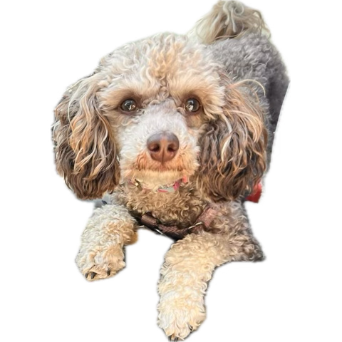
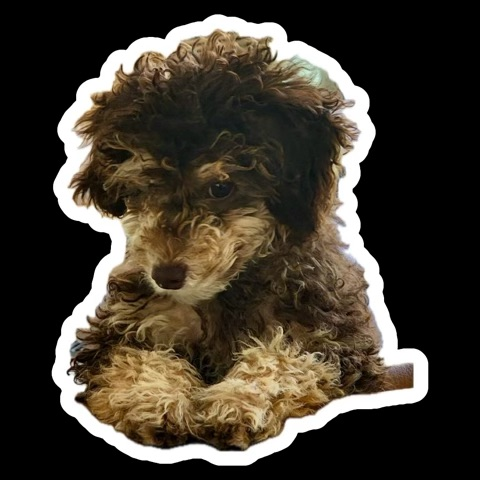
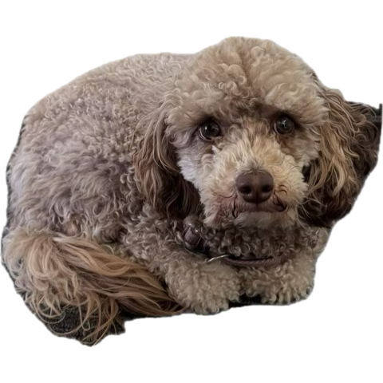
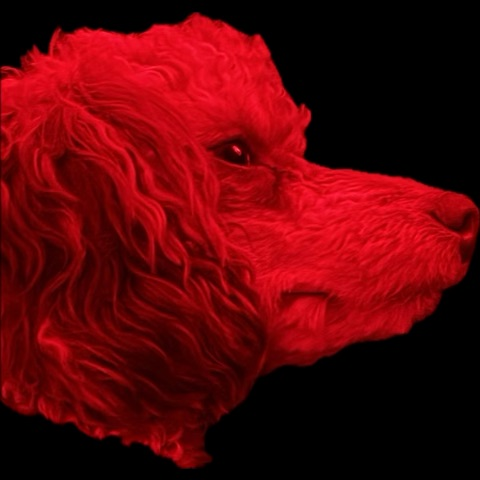

# Biscuit reference photography

This directory holds 55 reference images of Biscuit, the real miniature poodle the
platform's mascot is drawn from. They are all of the same dog, and they range from when she
was a little puppy to an adolescent, gathered as reference material for
[the first pose set](../../direction.md#the-first-pose-set): the character reference sheet
that has to fix her proportions, colouring, face, ears, tail and paws before an illustrator
draws a single pose from them.

Nothing here is a finished asset. The images are source material only, kept beside the
design direction they inform rather than beside the shipped icons and fonts under
`src/lib/assets/`, because they are never going to ship themselves.

Every file below has been opened and described. The index says what each one shows, what it
is good for, and what in it must not be trusted, because a reference sheet drawn from an
unread folder is how a character drifts.

## What these files are

They are not raw camera frames. All 55 are 480×480 iOS sticker cutouts: the subject lifted
out of a photograph with the background removed, then exported. That has four consequences
the reference sheet has to work around.

- **The edge is the cutout's, not the animal's.** Where a leg, an ear or the tail ran past
  the edge of the source photograph, the cutout slices it flat. Nothing in this corpus is a
  reliable outline, and proportion cannot be measured from any of it.
- **Two formats, and the difference matters.** 35 files are PNG and keep a live alpha
  channel, so she floats on transparency. 20 are JPEG, the same cutouts flattened onto
  **black**, which costs the floor line and the rear outline outright and collapses a brown
  dog in dim light toward a silhouette.
- **Some carry a baked-in white sticker outline** that adds several pixels to her real edge.
  Those must never be traced for the reduced icon-mark.
- **Seven pairs are one instant exported twice**, usually a PNG and its JPEG twin. The
  corpus therefore holds about 48 distinct moments, not 55, and treating both halves of a
  pair as independent evidence quietly doubles the weight of seven of them.

Two of the 55 are not photographs at all, and one shows no dog. They are listed and marked
rather than deleted, because a reader who finds them unlabelled will assume they are
reference.

## How to read the index

Each row gives the file, a grade, a description, tags and the moments it could serve. The
tag vocabulary is closed, so it can be searched.

| Group | Values |
| --- | --- |
| Stage | `puppy`, `juvenile`, `adolescent` |
| Pose | `sit`, `stand`, `bipedal`, `lying`, `curled`, `sprawled`, `belly-up`, `walking`, `running`, `rolling`, `head-only`, `close-up` |
| Angle | `frontal`, `three-quarter`, `profile`, `rear-view`, `from-above` |
| Coat value | `rich-chocolate`, `mid-brown`, `faded-cafe-au-lait`, `pale-cream-cast`, `indeterminate-coat` |
| Feature legible | `liver-nose`, `amber-eyes`, `cream-markings`, `curl-texture`, `topline`, `tail-pom`, `paw-pads`, `whole-silhouette` |
| Light | `daylight`, `indoor`, `low-light`, `backlit`, `low-sun`, `blown-out`, `red-cast` |
| Hazard | `sticker-border`, `black-flatten`, `cropped-limb`, `matte-artefact`, `motion-blur`, `rotated-export`, `low-resolution`, `second-subject`, `not-a-photo` |

The grade is how much weight a frame carries, not how good a photograph it is.

| Grade | Meaning | Count |
| --- | --- | --- |
| prime | Draw from it directly. | 22 |
| usable | Good for one thing; read the caution before taking anything else. | 29 |
| marginal | Almost nothing survives, but what does is not available elsewhere. | 1 |
| unusable | Do not draw from it at all. | 3 |

Every hazard tag is explained under [Read these with care](#read-these-with-care), and the
things no frame answers are under
[What this corpus cannot answer](#what-this-corpus-cannot-answer).

## What is fixed

These hold across the whole corpus, at every age and in every light. They are what the
reference sheet has to lock, and each one names the mistake an illustrator makes without it.

### Liver nose, never black

The nose leather is a warm liver brown a shade or two off her body colour, with the nostrils
and philtrum reading only slightly darker and never approaching black. It is large relative to
her short muzzle and it stays brown in puppy frames, faded adolescent frames and dim frames
alike. An illustrator working from breed defaults will draw a black nose, and that single
substitution breaks the character more visibly than any proportion error.

Seen in
[biscuit-puppy-lying-sticker-outline-head-tilt](cutouts/biscuit-puppy-lying-sticker-outline-head-tilt.jpeg),
[biscuit-puppy-lying-forepaws-pads](cutouts/biscuit-puppy-lying-forepaws-pads.png),
[biscuit-adolescent-sphinx-paws-forward](cutouts/biscuit-adolescent-sphinx-paws-forward.png),
[biscuit-puppy-lying-overhead-pale-floor](cutouts/biscuit-puppy-lying-overhead-pale-floor.png).

### Amber eyes with brown rims

The iris is light golden amber, warm and pale enough to separate from the pupil at small sizes,
and the pigment ringing the eye is liver brown rather than black, consistent with the nose. The
eyes are round and set wide on a rounded skull. The default mistake is a dark brown or black
button eye, which loses the one feature that makes her face read as hers rather than as a stock
poodle.

Seen in
[biscuit-adolescent-sphinx-paws-forward](cutouts/biscuit-adolescent-sphinx-paws-forward.png),
[biscuit-adolescent-sit-mouth-wide-open](cutouts/biscuit-adolescent-sit-mouth-wide-open.jpeg),
[biscuit-adolescent-loaf-flat-stare-2](cutouts/biscuit-adolescent-loaf-flat-stare-2.jpeg),
[biscuit-puppy-lying-forepaws-pads](cutouts/biscuit-puppy-lying-forepaws-pads.png).

### The phantom marking map and where it sits

Cream to tan sits in five fixed places and nowhere else: a band wrapping the whole muzzle from
behind the nose back under the eyes, a pair of cream pips directly above each eye, a bib on the
chest and throat, stockings from about the elbow and hock down, and cream feet. Everything else
— skull, ear leathers, back, flanks, rump — is the darker body colour. An illustrator will
otherwise paint an evenly coloured dog, or give her white feet only, and the eyebrow pips are
the piece most often dropped even though they carry the expression.

Seen in
[biscuit-puppy-lying-sticker-outline-head-tilt](cutouts/biscuit-puppy-lying-sticker-outline-head-tilt.jpeg),
[biscuit-puppy-lying-overhead-pale-floor](cutouts/biscuit-puppy-lying-overhead-pale-floor.png),
[biscuit-puppy-sprawl-overhead-forelegs-out](cutouts/biscuit-puppy-sprawl-overhead-forelegs-out.jpeg),
[biscuit-puppy-lying-forepaws-pads](cutouts/biscuit-puppy-lying-forepaws-pads.png).

### The ear leathers are the darkest thing on her

At every age the hair on the ears is darker and warmer than the body, and as the body fades the
ears keep their brown, so adolescent frames show a near-cream dog with two clearly brown ears.
This is the single strongest defence against the cream drift the direction calls a defect. An
illustrator averaging one coat value across the whole animal will flatten the ears into the
body and lose the read entirely at icon size.

Seen in [biscuit-adolescent-run-tongue-out](cutouts/biscuit-adolescent-run-tongue-out.jpeg),
[biscuit-adolescent-walk-ball-in-mouth](cutouts/biscuit-adolescent-walk-ball-in-mouth.png),
[biscuit-adolescent-run-ears-airborne](cutouts/biscuit-adolescent-run-ears-airborne.png),
[biscuit-adolescent-stand-fish-bandana](cutouts/biscuit-adolescent-stand-fish-bandana.png).

### Low drop ears in longer, wavier hair

The ears are set low, at roughly eye level, and hang clear of the cheek as two distinct lobes
reaching about to the jawline, covered in longer and looser waves than the tighter curl of the
body. They swing and lift independently when she moves. The default errors are a high ear set,
a short ear, or ears drawn in the same curl texture as the body, all of which square off a head
that is round in every frame.

Seen in
[biscuit-adolescent-sphinx-paws-forward](cutouts/biscuit-adolescent-sphinx-paws-forward.png),
[biscuit-adolescent-sit-mouth-wide-open](cutouts/biscuit-adolescent-sit-mouth-wide-open.jpeg),
[biscuit-adolescent-stand-overhead-rear-2](cutouts/biscuit-adolescent-stand-overhead-rear-2.jpeg),
[biscuit-puppy-sit-head-turned](cutouts/biscuit-puppy-sit-head-turned.png).

### Short blunt muzzle on a domed skull

The muzzle is short and blunt with a soft stop, and the skull above it is domed and round, so
the whole head reads as a circle with a stub on the front rather than as a wedge. This holds
from puppy through adolescent frames and in the one profile the corpus has. An illustrator
reaching for the long tapering show-poodle head will lengthen the muzzle and narrow the skull,
which ages her and makes her elegant, and she is neither.

Seen in
[biscuit-adolescent-sphinx-paws-forward](cutouts/biscuit-adolescent-sphinx-paws-forward.png),
[biscuit-adolescent-loaf-flat-stare](cutouts/biscuit-adolescent-loaf-flat-stare.png),
[biscuit-adolescent-profile-head-red-filter](cutouts/biscuit-adolescent-profile-head-red-filter.jpeg),
[biscuit-adolescent-sit-mouth-wide-open](cutouts/biscuit-adolescent-sit-mouth-wide-open.jpeg).

### Unclipped coat, soft irregular waves

She is never groomed to a pattern. The coat is soft, open, slightly irregular waves and loose
curls, longest on the skull as a shapeless topknot and on the ears and legs, with no clipped
line anywhere — the face is not shaved, the feet are not shaved, and there are no bracelets or
rosettes. The default mistake is the continental show trim, which is what a generic reference
for the word poodle returns and which would put a barbered dog inside a workshop that is
supposed to hold exactly one soft thing.

Seen in
[biscuit-puppy-lying-sticker-outline-head-tilt](cutouts/biscuit-puppy-lying-sticker-outline-head-tilt.jpeg),
[biscuit-adolescent-loaf-flat-stare](cutouts/biscuit-adolescent-loaf-flat-stare.png),
[biscuit-adolescent-run-tongue-out](cutouts/biscuit-adolescent-run-tongue-out.jpeg),
[biscuit-adolescent-stand-overhead-topline](cutouts/biscuit-adolescent-stand-overhead-topline.png).

### Tail carries a paler plume

The tail ends in a fuller, longer, distinctly paler tuft of hair than the shaft or the body
carries, visible from above at rest and streaming behind her at a run. It is a plume, not a
bare whip and not a shaved pom on a clipped stalk. An illustrator will otherwise draw either
the show-trim pom on a naked tail or a smooth tapered tail, and both contradict the unclipped
coat above.

Seen in
[biscuit-puppy-sprawl-overhead-forelegs-out](cutouts/biscuit-puppy-sprawl-overhead-forelegs-out.jpeg),
[biscuit-adolescent-stand-overhead-rear-2](cutouts/biscuit-adolescent-stand-overhead-rear-2.jpeg),
[biscuit-adolescent-run-grass-tail-streaming](cutouts/biscuit-adolescent-run-grass-tail-streaming.png),
[biscuit-adolescent-loaf-flat-stare-2](cutouts/biscuit-adolescent-loaf-flat-stare-2.jpeg).

### Dark pads under cream foot feathering

The pads are dark slate to charcoal brown and the hair over and between the toes is cream, so
from above and from the side the foot reads as a pale mop and the dark only appears when the
sole turns to the camera. The default mistake is pink pads, or a clipped poodle foot with the
toes exposed, either of which contradicts the marking map and the unclipped coat.

Seen in [biscuit-puppy-lying-forepaws-pads](cutouts/biscuit-puppy-lying-forepaws-pads.png),
[biscuit-puppy-lying-overhead-pale-floor](cutouts/biscuit-puppy-lying-overhead-pale-floor.png),
[biscuit-puppy-sprawl-overhead-forelegs-out](cutouts/biscuit-puppy-sprawl-overhead-forelegs-out.jpeg),
[biscuit-adolescent-belly-up-sunlit-harness](cutouts/biscuit-adolescent-belly-up-sunlit-harness.png).

Two of these are worth stating twice, because they are the ones a generic poodle reference
overrides: **the nose is liver brown, not black**, and **the eyes are amber, not dark**.

## What varies, and must be chosen

These change across the corpus. Averaging them produces a dog that appears in no photograph,
so each has to be decided once and then held.

### Body coat value

Her body value travels the whole way from deep saturated chocolate as a puppy to a greyish
café-au-lait as an adolescent, and several bright-daylight frames push past that to something
that reads cream. This must be chosen, not averaged, and the direction settles which way:
recognisably brown points at the dark end. Take the puppy chocolate as the reference value,
treat the café-au-lait loaf as the absolute lightest she is ever permitted to be drawn, and
treat every pale-cream-cast frame as an exposure artefact that carries no colour information at
all.

Ends:
[biscuit-puppy-lying-sticker-outline-head-tilt](cutouts/biscuit-puppy-lying-sticker-outline-head-tilt.jpeg)
against [biscuit-adolescent-loaf-flat-stare](cutouts/biscuit-adolescent-loaf-flat-stare.png).

### Contrast between body and markings

The marking pattern is fixed but its legibility is not. In the puppy frames the cream mask, bib
and stockings cut hard against the body; in the faded adolescent frames the same marks barely
separate and the dog reads as one tone with slightly darker ears. Because the reduced icon-mark
has to work at sixteen pixels, the sheet must pick a body value dark enough that the mask and
the stockings still read as marks and not as shading.

Ends: [biscuit-puppy-lying-forepaws-pads](cutouts/biscuit-puppy-lying-forepaws-pads.png)
against [biscuit-adolescent-loaf-flat-stare](cutouts/biscuit-adolescent-loaf-flat-stare.png).

### Coat length and groom state

She appears both long and shaggy, with the waves loose enough to break up her outline, and
freshly short, with the curl tight against the body and the silhouette clean. Neither is wrong
and the two produce visibly different animals, so one has to be named and held. The shaggier
end is funnier and reads more clearly as unclipped; the shorter end gives the icon-mark a
silhouette it can survive at small size.

Ends:
[biscuit-puppy-lying-sticker-outline-head-tilt](cutouts/biscuit-puppy-lying-sticker-outline-head-tilt.jpeg)
against
[biscuit-adolescent-run-ears-airborne](cutouts/biscuit-adolescent-run-ears-airborne.png).

### Ear hair length

Puppy ears are short and sit close to the head; adolescent ears carry long wavy hair that hangs
well below the jaw and flies clear of the skull at a run. Since the ears are the trait the mark
is most likely to be built from, their length is a decision with consequences beyond the face
and cannot be left to the individual pose.

Ends:
[biscuit-puppy-lying-sticker-outline-frontal](cutouts/biscuit-puppy-lying-sticker-outline-frontal.png)
against [biscuit-adolescent-run-tongue-out](cutouts/biscuit-adolescent-run-tongue-out.jpeg).

### Head-to-body proportion by age

The puppy frames give an oversized head on a short-legged body; the adolescent frames give
adult proportions on a leggy frame with a longer muzzle. The corpus tempts a blend because the
colour evidence is strongest in the puppy frames and the proportion evidence is strongest in
the adolescent ones, and a blend produces a dog that exists in no photograph. Name one age,
take proportion only from that age, and let the puppy frames inform colour alone.

Ends: [biscuit-puppy-lying-forepaws-pads](cutouts/biscuit-puppy-lying-forepaws-pads.png)
against [biscuit-adolescent-run-tongue-out](cutouts/biscuit-adolescent-run-tongue-out.jpeg).

### Whether the eyes clear the fringe

In some frames the topknot falls over the brow and the eyes are entirely veiled, leaving only
the muzzle and nose to carry the face; in others the hair is back and both amber eyes hold the
lens. One face learned by heart cannot have it both ways. The open-eyed read is the one that
supports a fixed face and a rare break, and the veiled frames are then available as a
deliberate state rather than as a drawing variation.

Ends:
[biscuit-juvenile-head-lowered-curls-over-eyes](cutouts/biscuit-juvenile-head-lowered-curls-over-eyes.jpeg)
against
[biscuit-adolescent-sphinx-paws-forward](cutouts/biscuit-adolescent-sphinx-paws-forward.png).

### The range she has to stay inside

The direction states that she "stays recognisably brown" and that "drifting toward cream or
white is a defect, not a variation". The corpus makes that a live risk rather than a
theoretical one: her body value travels the whole way from the chocolate on the left to the
café-au-lait on the right, and hard sun pushes several frames past the right-hand end into
something that reads cream.

Left is the reference value. Right is the lightest she may ever be drawn. Anything paler in
this folder is the exposure, not the dog.

## The index

Fifty-five files, grouped by age and then by grade. The second line of each description is
the thing that frame must not be trusted for.

12 puppy, 13 juvenile, 30 adolescent. Her age in a frame is the owner's call, not a reading of
the pixels, and where the two disagreed the owner won.

### Puppy

The colour evidence lives here. Every frame but the silhouette is rich chocolate at full
marking contrast, all of it shot indoors or in low light, and the only closed eyes in the
corpus are in this group.

| Photo | Grade | What it shows | Tags | Best for |
| --- | --- | --- | --- | --- |
| [biscuit-puppy-asleep-head-down](cutouts/biscuit-puppy-asleep-head-down.jpeg) | prime | Asleep with her head down on a surface, eyes shut, liver nose and cream muzzle filling the frame. _Only the head is in frame, so nothing here fixes proportion._ | lying, eyes-closed, head-only, puppy, rich-chocolate, liver-nose, black-flatten, indoor | sleepy, colour-reference |
| [biscuit-puppy-curled-lamb-toy-bed](cutouts/biscuit-puppy-curled-lamb-toy-bed.jpeg) | prime | Puppy lying in a sheepskin bed with her chin over a lamb toy, looking straight at the camera. | curled, lying, dog-bed, plush-toy, eye-contact, puppy, rich-chocolate, black-flatten | face-reference, colour-reference, sleepy |
| [biscuit-puppy-lying-forepaws-pads](cutouts/biscuit-puppy-lying-forepaws-pads.png) | prime | Puppy lying with both forepaws thrown at the lens, chin low, dark pads showing under cream feathering. _Everything behind the shoulders leaves the frame, so proportion is not readable._ | lying, frontal, puppy, rich-chocolate, liver-nose, amber-eyes, paw-pads, indoor | face-reference, colour-reference, idle |
| [biscuit-puppy-lying-overhead-pale-floor](cutouts/biscuit-puppy-lying-overhead-pale-floor.png) | prime | Puppy lying flat on a pale floor, forelegs stretched out, head lifted almost square to a camera above. | lying, from-above, eye-contact, puppy, rich-chocolate, cream-markings, clean-cutout, indoor | face-reference, colour-reference, idle |
| [biscuit-puppy-lying-sticker-outline-frontal](cutouts/biscuit-puppy-lying-sticker-outline-frontal.png) | prime | Puppy lying square to the lens with both cream forepaws forward, inside a thick white sticker outline. _The baked-in white outline thickens her true silhouette._ | lying, frontal, puppy, rich-chocolate, sticker-border, liver-nose, amber-eyes, indoor | face-reference, colour-reference, mark-silhouette, arrival |
| [biscuit-puppy-lying-sticker-outline-head-tilt](cutouts/biscuit-puppy-lying-sticker-outline-head-tilt.jpeg) | prime | Puppy lying with her forepaws stretched forward and her head tilted, inside a thick white sticker outline. _The baked-in white outline thickens her true silhouette._ | lying, three-quarter, head-tilt, puppy, rich-chocolate, sticker-border, liver-nose, cream-markings | colour-reference, face-reference, idle |
| [biscuit-puppy-sit-head-turned](cutouts/biscuit-puppy-sit-head-turned.png) | prime | A chocolate puppy sits square to the camera, cream chin and tan feet, looking just past the lens. _The baked-in white outline thickens her true silhouette._ | sit, three-quarter, puppy, rich-chocolate, cream-markings, liver-nose, sticker-border, indoor | face-reference, colour-reference, idle |
| [biscuit-puppy-sit-looking-up](cutouts/biscuit-puppy-sit-looking-up.png) | prime | Puppy sitting square and looking straight up, cream muzzle bright against a deep chocolate head. _The top of her skull and both ear tips are sliced off by the frame._ | sit, frontal, eye-contact, puppy, rich-chocolate, liver-nose, amber-eyes, cropped-limb | face-reference, arrival, colour-reference |
| [biscuit-puppy-sprawl-overhead-forelegs-out](cutouts/biscuit-puppy-sprawl-overhead-forelegs-out.jpeg) | prime | Sprawled flat on her front from directly above, forelegs stretched out, amber eyes angled up at the lens. | sprawled, from-above, eye-contact, puppy, rich-chocolate, cream-markings, tail-pom, black-flatten | idle, face-reference, colour-reference |
| [biscuit-puppy-belly-up-mouth-open](cutouts/biscuit-puppy-belly-up-mouth-open.png) | usable | Puppy on her back from above, running diagonally across the frame, mouth open, collar tag catching light. _Shadow crushes the body and the hind feet are sliced flat at the frame edge._ | belly-up, from-above, mouth-open, collar, puppy, rich-chocolate, low-light, cropped-limb | idle, win |
| [biscuit-puppy-side-lying-head-up](cutouts/biscuit-puppy-side-lying-head-up.png) | usable | Puppy on her side with her head tipped up, cream chest taking the only light, rump out of frame. _The body is near-black and an orange fringe survives along the cutout edge._ | lying, from-above, puppy, rich-chocolate, cream-markings, amber-eyes, low-light, cropped-limb | sleepy, idle |
| [biscuit-puppy-bipedal-silhouette](cutouts/biscuit-puppy-bipedal-silhouette.jpeg) | marginal | Near-silhouette of her standing upright on her hind legs in profile, forelegs bent at her chest. _Only the outline survives the black flatten; nothing here carries colour or face._ | bipedal, profile, silhouette, low-light, black-flatten, indeterminate-coat, low-resolution, small-in-frame | mark-silhouette |

### Juvenile

The weakest group, and the only one holding no prime frame at all. The coat is on the turn,
every frame is indoors, dim or under a red cast, and much of it has clothing in the way.

| Photo | Grade | What it shows | Tags | Best for |
| --- | --- | --- | --- | --- |
| [biscuit-juvenile-belly-up-bare-belly](cutouts/biscuit-juvenile-belly-up-bare-belly.png) | usable | On her back seen from directly above, legs splayed, belly fur thin enough to show the skin underneath. _A flat white notch of unremoved background sits beside the left hind leg._ | belly-up, sprawled, from-above, indoor, mid-brown, matte-artefact, juvenile, thin-belly-fur | sleepy, idle |
| [biscuit-juvenile-belly-up-dim-floor](cutouts/biscuit-juvenile-belly-up-dim-floor.png) | usable | Flat on her back on a dark floor, limbs dropped outward, head lolled back, shot from directly above. _The frame is dim and grainy, so the eyes are not readable._ | belly-up, sprawled, from-above, low-light, mid-brown, sticker-border, low-resolution, juvenile | sleepy, mark-silhouette, idle |
| [biscuit-juvenile-belly-up-forelegs-folded](cutouts/biscuit-juvenile-belly-up-forelegs-folded.png) | usable | On her back with her head tipped away, one amber eye open, cream forelegs folded over a bare belly. _The hindquarters are sliced flat at the frame edge, so proportion is not readable._ | belly-up, from-above, rich-chocolate, cream-markings, liver-nose, amber-eyes, indoor, cropped-limb | colour-reference, sleepy |
| [biscuit-juvenile-chin-on-paws-red-cast](cutouts/biscuit-juvenile-chin-on-paws-red-cast.png) | usable | Lying with her chin down between both forepaws beside a folded blanket, the whole frame flooded red. _The red flood makes coat and eye colour unrecoverable; only the marking pattern separates._ | lying, head-down, red-cast, blanket, indeterminate-coat, cropped-limb, matte-artefact, juvenile | sleepy |
| [biscuit-juvenile-curled-underexposed-head-low](cutouts/biscuit-juvenile-curled-underexposed-head-low.jpeg) | usable | Curled with her head lowered to the camera, near-black as delivered, cream mask and forepaws recoverable. _As delivered it reads far darker than she is; lift the tone before taking any coat value._ | curled, lying, low-light, black-flatten, sticker-border, cropped-limb, mid-brown, liver-nose | loss, sleepy |
| [biscuit-juvenile-head-down-dim-profile](cutouts/biscuit-juvenile-head-down-dim-profile.png) | usable | Lying with her head down and turned aside, muzzle in profile, the room too dark to hold her body. _Underexposure loses the body and any reliable colour._ | lying, profile, head-down, low-light, indeterminate-coat, sticker-border, matte-artefact, juvenile | sleepy, sign-off |
| [biscuit-juvenile-head-lowered-curls-over-eyes](cutouts/biscuit-juvenile-head-lowered-curls-over-eyes.jpeg) | usable | Head lowered and shot from above, chocolate curls falling across the eyes, cream muzzle and liver nose lit. _Hair veils both eyes and there is no body here to judge proportion from._ | head-only, from-above, rich-chocolate, liver-nose, cream-markings, sticker-border, indoor, eyes-veiled | colour-reference, sleepy |
| [biscuit-juvenile-side-lying-hand-on-ribs](cutouts/biscuit-juvenile-side-lying-hand-on-ribs.png) | usable | Lying on her side in sock-monkey booties, a striped toy at her mouth, a hand pressing her ribs. _A human forearm crosses the torso and booties hide every paw._ | lying, profile, booties, human-hand, toy-in-mouth, indoor, rich-chocolate, cream-markings | sleepy, colour-reference |
| [biscuit-juvenile-sit-rear-pink-collar](cutouts/biscuit-juvenile-sit-rear-pink-collar.png) | usable | Exported upside down; turned upright she sits with her back to the lens, head tipped, pink buckled collar showing. _The file sits 180 degrees off and the face is absent, so do not read the pose as delivered._ | sit, rear-view, rotated-export, collar, low-light, matte-artefact, mid-brown, no-face | sign-off |
| [biscuit-juvenile-sprawl-profile-booties](cutouts/biscuit-juvenile-sprawl-profile-booties.jpeg) | usable | Sprawled in profile against flat black, hind legs kicked back, booties on every visible paw. _The rear merges into the black flatten and the tail cannot be picked out at all._ | sprawled, profile, booties, low-light, black-flatten, rich-chocolate, topline, juvenile | sleepy, idle |
| [biscuit-juvenile-cartoon-head-on-keyboard](cutouts/biscuit-juvenile-cartoon-head-on-keyboard.png) | unusable | A flat cel-shaded cartoon of a curly poodle head tipped against a laptop keyboard, heavy black outline. _Not a photograph: every proportion and colour here is the illustrator's invention._ | not-a-photo, illustration, head-only, laptop, sticker-border, indoor, indeterminate-coat, reject | none |
| [biscuit-juvenile-cartoon-peeking-over-laptop](cutouts/biscuit-juvenile-cartoon-peeking-over-laptop.png) | unusable | A cel-shaded cartoon poodle rests her chin and forepaws on an open laptop; this is a drawing. _Not a photograph: the drawn eyes are dark, contradicting her amber ground truth._ | not-a-photo, illustration, head-only, laptop, sticker-border, indoor, indeterminate-coat, reject | none |
| [biscuit-juvenile-legs-only-sock-monkey-socks](cutouts/biscuit-juvenile-legs-only-sock-monkey-socks.png) | unusable | Close-up of two legs in grey sock-monkey dog socks, red rubber grip pads turned to the camera. _The socks cover both paws and no head or body is in frame._ | close-up, socks, no-face, cropped-limb, indoor, indeterminate-coat, paws-covered, reject | none |

### Adolescent

The pose evidence lives here — running, rearing, rolling and loafing — and so does the fade. It
is also the only group shot in daylight, which is exactly why its coat values are the least
trustworthy in the folder.

| Photo | Grade | What it shows | Tags | Best for |
| --- | --- | --- | --- | --- |
| [biscuit-adolescent-bipedal-looking-up](cutouts/biscuit-adolescent-bipedal-looking-up.png) | prime | Reared on her hind legs and looking up at the lens, patterned harness across the chest. _The harness hides the chest and topline._ | bipedal, from-above, eye-contact, harness, daylight, pale-cream-cast, liver-nose, amber-eyes | arrival, long-absence, face-reference |
| [biscuit-adolescent-loaf-flat-stare](cutouts/biscuit-adolescent-loaf-flat-stare.png) | prime | Loafed with her legs tucked and her head up, looking flat into the lens from slightly above. _Both ears are clipped by the frame and a dark patch of background survives at lower left._ | curled, frontal, eye-contact, faded-cafe-au-lait, liver-nose, amber-eyes, indoor, matte-artefact | face-reference, colour-reference, idle |
| [biscuit-adolescent-loaf-flat-stare-2](cutouts/biscuit-adolescent-loaf-flat-stare-2.jpeg) | prime | The same loaf flattened onto black: curled on the floor, looking straight up into the lens. _The black flatten swallows the floor line and part of her rear outline._ | curled, frontal, eye-contact, faded-cafe-au-lait, liver-nose, amber-eyes, indoor, black-flatten | face-reference, colour-reference, idle |
| [biscuit-adolescent-lying-grass-teeth-showing-2](cutouts/biscuit-adolescent-lying-grass-teeth-showing-2.jpeg) | prime | The same moment, tighter and brighter: head lifted from the grass, mouth open, ears splayed wide. _A dark second animal at right sinks into the black flatten and eats her rear outline._ | lying, frontal, grass, mouth-open, eye-contact, mid-brown, black-flatten, second-subject | win, arrival, face-reference |
| [biscuit-adolescent-lying-plush-toy](cutouts/biscuit-adolescent-lying-plush-toy.png) | prime | Lying behind a plush toy pressed to her chest, harness on, tongue tip out, staring at the camera. _The crown is shaved flat by the top edge and a black halo rings part of the cutout._ | lying, three-quarter, plush-toy, harness, tongue-out, eye-contact, daylight, pale-cream-cast | face-reference, arrival |
| [biscuit-adolescent-run-ears-airborne](cutouts/biscuit-adolescent-run-ears-airborne.png) | prime | Running straight at the camera with both ears lifted clear of her head and her mouth open. _The near foreleg is sliced at the bottom edge and the ear flaps carry motion smear._ | running, frontal, ears-flying, mouth-open, eye-contact, daylight, pale-cream-cast, motion-blur | arrival, win |
| [biscuit-adolescent-run-tongue-out](cutouts/biscuit-adolescent-run-tongue-out.jpeg) | prime | Running at the camera with ears flying and tongue out, harness on, flattened onto black. _The ear tips and forelegs carry motion smear._ | running, frontal, ears-flying, tongue-out, harness, daylight, faded-cafe-au-lait, black-flatten | arrival, win, face-reference |
| [biscuit-adolescent-sit-mouth-wide-open](cutouts/biscuit-adolescent-sit-mouth-wide-open.jpeg) | prime | Looking up into the lens with her mouth wide open, tongue down, collar tags catching the light. _Everything below the chest is inferred, and a green grass fringe clings to the left ear._ | sit, frontal, mouth-open, eye-contact, collar, daylight, faded-cafe-au-lait, black-flatten | win, face-reference |
| [biscuit-adolescent-sit-pink-heart-collar](cutouts/biscuit-adolescent-sit-pink-heart-collar.jpeg) | prime | Sitting square to the lens and looking up, pink heart collar and harness on, cream body with tan ears. _The baked-in white outline thickens her true silhouette._ | sit, frontal, eye-contact, collar, harness, sticker-border, indoor, pale-cream-cast | face-reference, arrival, idle |
| [biscuit-adolescent-sit-pink-heart-collar-2](cutouts/biscuit-adolescent-sit-pink-heart-collar-2.png) | prime | The same sit, wider: pink collar and harness, looking straight up, forelegs braced below her. _The baked-in white outline thickens her true silhouette._ | sit, from-above, eye-contact, collar, harness, sticker-border, pale-cream-cast, cropped-limb | arrival, face-reference, colour-reference |
| [biscuit-adolescent-sphinx-paws-forward](cutouts/biscuit-adolescent-sphinx-paws-forward.png) | prime | Lying sphinx-style with both forelegs stretched at the lens, head up, holding direct eye contact. _The hindquarters sit outside the frame and the near foreleg is cut at the bottom._ | lying, frontal, eye-contact, collar, daylight, faded-cafe-au-lait, sticker-border, cropped-limb | face-reference, colour-reference, idle |
| [biscuit-adolescent-trot-overhead-tongue-out](cutouts/biscuit-adolescent-trot-overhead-tongue-out.jpeg) | prime | Trotting up at the camera from above, tongue out, harness on, the body reading cream in hard daylight. _Bright sun lifts the coat toward cream, so this frame overstates how pale she is._ | walking, from-above, tongue-out, harness, daylight, faded-cafe-au-lait, sticker-border, black-flatten | face-reference, arrival |
| [biscuit-adolescent-walk-ball-in-mouth](cutouts/biscuit-adolescent-walk-ball-in-mouth.png) | prime | Walking straight at the camera with a blue-and-orange ball in her mouth, body cream throughout, one ear still brown. _Her hind feet meet the bottom edge, so leg length cannot be measured from this frame._ | walking, frontal, ball, harness, eye-contact, daylight, pale-cream-cast, adolescent | arrival, win, face-reference, colour-reference |
| [biscuit-adolescent-back-roll-open-mouth](cutouts/biscuit-adolescent-back-roll-open-mouth.jpeg) | usable | Sideways in the export: shot from above, she lies on her back mid-roll, limbs splayed, mouth open. _The export sits sideways and the source frame slices limbs flat on three sides._ | belly-up, rolling, from-above, mouth-open, rotated-export, black-flatten, cropped-limb, faded-cafe-au-lait | idle, win |
| [biscuit-adolescent-back-roll-open-mouth-2](cutouts/biscuit-adolescent-back-roll-open-mouth-2.jpeg) | usable | The same roll, wider crop: head thrown back, mouth open on a white canine, one forepaw over her muzzle. _The export sits sideways, the face is blurred, and the chin and two limbs are sliced flat._ | belly-up, rolling, from-above, mouth-open, rotated-export, black-flatten, motion-blur, faded-cafe-au-lait | win, idle |
| [biscuit-adolescent-belly-up-sunlit-harness](cutouts/biscuit-adolescent-belly-up-sunlit-harness.png) | usable | Upside down in the export: on her back in bright sun, harness still on, legs dropped outward. _Sun flares the one visible eye pale blue-grey; her eyes are amber, not this._ | belly-up, sprawled, from-above, rotated-export, harness, daylight, faded-cafe-au-lait, matte-artefact | win, idle, colour-reference |
| [biscuit-adolescent-bipedal-jaws-open](cutouts/biscuit-adolescent-bipedal-jaws-open.png) | usable | Up on her hind legs in a pink harness, jaws open and her head thrown back. _The near hind leg is sliced off at the frame edge, so proportion is unreliable._ | bipedal, three-quarter, harness, mouth-open, daylight, faded-cafe-au-lait, cropped-limb, matte-artefact | win, arrival |
| [biscuit-adolescent-chin-down-party-hat](cutouts/biscuit-adolescent-chin-down-party-hat.jpeg) | usable | Wearing a paw-print party hat with green trim, she lies chin down and looks up without moving. _The black flatten and edge fringing make the body outline unreliable._ | lying, frontal, party-hat, head-down, eye-contact, mid-brown, black-flatten, indoor | loss, long-absence, face-reference |
| [biscuit-adolescent-head-on-blanket-red-cast](cutouts/biscuit-adolescent-head-on-blanket-red-cast.png) | usable | Head down on a blanket, three-quarter from her left, the near eye open with a windowpane catchlight. _The red flood destroys colour outright; take structure from this frame, never value._ | lying, head-down, close-up, red-cast, indeterminate-coat, cropped-limb, matte-artefact, adolescent | sleepy, idle |
| [biscuit-adolescent-lying-grass-teeth-showing](cutouts/biscuit-adolescent-lying-grass-teeth-showing.png) | usable | Lying low in grass with her head to the camera and her mouth open on her lower teeth. _An unremoved dark second animal corrupts the right edge and her rear outline._ | lying, three-quarter, grass, mouth-open, eye-contact, daylight, mid-brown, second-subject | colour-reference, loss |
| [biscuit-adolescent-profile-head-red-filter](cutouts/biscuit-adolescent-profile-head-red-filter.jpeg) | usable | Profile head study rendered in flat saturated red on black, curl structure and muzzle line intact. _The red filter destroys every coat and eye colour in the frame._ | head-only, profile, red-cast, black-flatten, indeterminate-coat, cropped-limb, sharp-detail, adolescent | face-reference, mark-silhouette |
| [biscuit-adolescent-run-grass-tail-streaming](cutouts/biscuit-adolescent-run-grass-tail-streaming.png) | usable | Running over grass at full stride, mouth open, ears blown back, tail streaming behind her. _Hard sun pushes the coat near-white; the value here is the light, not her colour._ | running, from-above, ears-flying, mouth-open, blown-out, faded-cafe-au-lait, matte-artefact, cropped-limb | arrival, win |
| [biscuit-adolescent-sit-pink-sweater](cutouts/biscuit-adolescent-sit-pink-sweater.png) | usable | Sitting upright in a pink knit sweater, forelegs splayed forward, the face small and soft in the frame. _The knit sweater shapes the torso, so the body under it is not hers to draw._ | sit, frontal, sweater, daylight, mid-brown, low-resolution, matte-artefact, adolescent | idle |
| [biscuit-adolescent-sit-pink-sweater-2](cutouts/biscuit-adolescent-sit-pink-sweater-2.jpeg) | usable | The same sit flattened onto black: pink knit sweater, hind legs sprawled forward, eyes lost under the fringe. _Underexposure hides the eyes and the sweater hides the torso._ | sit, frontal, sweater, low-light, mid-brown, black-flatten, eyes-obscured, matte-artefact | idle, sleepy |
| [biscuit-adolescent-stand-fish-bandana](cutouts/biscuit-adolescent-stand-fish-bandana.png) | usable | Standing head-lowered in a fish-print bandana and harness, face soft, rear sliced flat by the frame. _Bright light washes the legs and chest toward white while the head stays tan._ | stand, three-quarter, bandana, harness, head-lowered, faded-cafe-au-lait, sticker-border, cropped-limb | sleepy, loss, colour-reference |
| [biscuit-adolescent-stand-low-sun-head-turned](cutouts/biscuit-adolescent-stand-low-sun-head-turned.png) | usable | Standing in low sun with her body angled away and her head brought round to the camera, tilted. _Low front sun gilds her chest pale gold, so the value here is the light and not the coat._ | stand, three-quarter, backlit, low-sun, indeterminate-coat, low-resolution, cropped-limb, adolescent | mark-silhouette, face-reference |
| [biscuit-adolescent-stand-low-sun-head-turned-2](cutouts/biscuit-adolescent-stand-low-sun-head-turned-2.png) | usable | The same low-sun stand, softer and larger: body angled away, head brought round and tilted to the camera. _Warm sun gilds the lit side gold while the shade reads mid-brown; neither value is trustworthy._ | stand, three-quarter, backlit, low-sun, indeterminate-coat, low-resolution, matte-artefact, adolescent | face-reference, mark-silhouette |
| [biscuit-adolescent-stand-overhead-rear](cutouts/biscuit-adolescent-stand-overhead-rear.png) | usable | Seen from above and behind as she stands, crown, drop ears, spine and tail plume toward the lens. _The face is absent and the feet are cut at the bottom edge._ | stand, rear-view, from-above, no-face, daylight, faded-cafe-au-lait, low-resolution, cropped-limb | sign-off, mark-silhouette |
| [biscuit-adolescent-stand-overhead-rear-2](cutouts/biscuit-adolescent-stand-overhead-rear-2.jpeg) | usable | The same overhead stand on black: domed crown, both drop ears, the spine and a pale tail plume. _The face is tucked underneath and absent, and the feet are cut at the bottom edge._ | stand, rear-view, from-above, no-face, black-flatten, faded-cafe-au-lait, cropped-limb, curl-texture | mark-silhouette, sign-off |
| [biscuit-adolescent-stand-overhead-topline](cutouts/biscuit-adolescent-stand-overhead-topline.png) | usable | Seen from directly overhead as she stands, head turned low and right, coat washed pale by sun. _Sun washes the coat pale, and the tail end is sliced flat by the frame._ | stand, from-above, topline, curl-texture, daylight, faded-cafe-au-lait, cropped-limb, clean-cutout | mark-silhouette |

### The seven duplicate pairs

Each of these is a single instant exported twice, matched by correlating the two subject
silhouettes at every ninety degrees. Count one, not two.

| The pair | What differs |
| --- | --- |
| [biscuit-adolescent-sit-pink-heart-collar](cutouts/biscuit-adolescent-sit-pink-heart-collar.jpeg), [biscuit-adolescent-sit-pink-heart-collar-2](cutouts/biscuit-adolescent-sit-pink-heart-collar-2.png) | One instant, two exports: she sits looking up in the pink heart collar and harness. The JPEG is the tighter crop flattened onto black, the PNG the wider one on alpha. Silhouette correlation 1.00. |
| [biscuit-adolescent-sit-pink-sweater](cutouts/biscuit-adolescent-sit-pink-sweater.png), [biscuit-adolescent-sit-pink-sweater-2](cutouts/biscuit-adolescent-sit-pink-sweater-2.jpeg) | One instant of the pink knit sweater sit, limb for limb. The JPEG is larger and flattened onto black; the PNG is smaller and paler. Silhouette correlation 1.00. |
| [biscuit-adolescent-loaf-flat-stare](cutouts/biscuit-adolescent-loaf-flat-stare.png), [biscuit-adolescent-loaf-flat-stare-2](cutouts/biscuit-adolescent-loaf-flat-stare-2.jpeg) | One instant of the loafed flat stare, and the light end of the coat range. PNG on alpha, JPEG on black. |
| [biscuit-adolescent-lying-grass-teeth-showing](cutouts/biscuit-adolescent-lying-grass-teeth-showing.png), [biscuit-adolescent-lying-grass-teeth-showing-2](cutouts/biscuit-adolescent-lying-grass-teeth-showing-2.jpeg) | One instant in the grass with the dark second animal at right. The JPEG is tighter and brighter, which is why it grades prime and the washed-out PNG only usable. Silhouette correlation 1.00. |
| [biscuit-adolescent-stand-overhead-rear](cutouts/biscuit-adolescent-stand-overhead-rear.png), [biscuit-adolescent-stand-overhead-rear-2](cutouts/biscuit-adolescent-stand-overhead-rear-2.jpeg) | One overhead-and-behind frame of her standing, easily misread as two: a walking-away rear view and an overhead stand are the same photograph. |
| [biscuit-adolescent-back-roll-open-mouth](cutouts/biscuit-adolescent-back-roll-open-mouth.jpeg), [biscuit-adolescent-back-roll-open-mouth-2](cutouts/biscuit-adolescent-back-roll-open-mouth-2.jpeg) | One instant of the back roll, both JPEG on black, differing only in crop. The pink at her mouth is the collar tag, not the tongue. |
| [biscuit-adolescent-stand-low-sun-head-turned](cutouts/biscuit-adolescent-stand-low-sun-head-turned.png), [biscuit-adolescent-stand-low-sun-head-turned-2](cutouts/biscuit-adolescent-stand-low-sun-head-turned-2.png) | One low-sun frame, both PNG, the second the larger export. The topline and the dropped hind leg make this a stand rather than a lie-down. |

## What to draw each moment from

The [first pose set](../../direction.md#the-first-pose-set) is a budget as much as a wish
list. These are the frames each of its moments can actually be drawn from, best first, with
the two registers the direction names at the end.

### Outcome: win

[biscuit-adolescent-sit-mouth-wide-open](cutouts/biscuit-adolescent-sit-mouth-wide-open.jpeg),
[biscuit-adolescent-lying-grass-teeth-showing-2](cutouts/biscuit-adolescent-lying-grass-teeth-showing-2.jpeg),
[biscuit-adolescent-back-roll-open-mouth-2](cutouts/biscuit-adolescent-back-roll-open-mouth-2.jpeg),
[biscuit-adolescent-belly-up-sunlit-harness](cutouts/biscuit-adolescent-belly-up-sunlit-harness.png)

Take the face from the first two, which are prime, frontal and hold the lens with the mouth
open, and the body attitude from the last two, which are the disproportionate behaviour the
register wants: she flings herself onto her back and stays there. The two roll frames are
rotated exports with a blurred face and a sun-flared eye, so they are posture evidence only.

### Outcome: loss

[biscuit-adolescent-chin-down-party-hat](cutouts/biscuit-adolescent-chin-down-party-hat.jpeg),
[biscuit-juvenile-curled-underexposed-head-low](cutouts/biscuit-juvenile-curled-underexposed-head-low.jpeg),
[biscuit-adolescent-stand-fish-bandana](cutouts/biscuit-adolescent-stand-fish-bandana.png)

The corpus is thin here and these are the least bad. The party hat frame is the closest thing
to the register — she lies chin down and looks up without moving — but the hat is a prop that
has to be discarded and the black flatten eats her outline. The curled frame reads genuinely
deflated once its tone is lifted, and the bandana stand gives a lowered head and half-shut eyes
with the body blown out to white.

### Bookend: arrival

[biscuit-adolescent-run-ears-airborne](cutouts/biscuit-adolescent-run-ears-airborne.png),
[biscuit-adolescent-run-tongue-out](cutouts/biscuit-adolescent-run-tongue-out.jpeg),
[biscuit-adolescent-bipedal-looking-up](cutouts/biscuit-adolescent-bipedal-looking-up.png),
[biscuit-adolescent-walk-ball-in-mouth](cutouts/biscuit-adolescent-walk-ball-in-mouth.png)

The best covered moment in the corpus. Two prime running frames come straight at the lens with
the ears lifted clear of the skull, one prime frame has her reared on her hind legs looking up,
and the walk with the ball gives the same approach slowed down with the whole front of the dog
readable. All four crop the feet at the bottom edge, so take stride from them and never leg
length.

### Bookend: sign-off

[biscuit-juvenile-sit-rear-pink-collar](cutouts/biscuit-juvenile-sit-rear-pink-collar.png),
[biscuit-adolescent-stand-overhead-rear-2](cutouts/biscuit-adolescent-stand-overhead-rear-2.jpeg),
[biscuit-juvenile-head-down-dim-profile](cutouts/biscuit-juvenile-head-down-dim-profile.png)

Only two frames in the whole corpus put her back to the camera, and both need work: the sit is
180 degrees off in the export and the overhead stand is shot from above rather than from her
own height, so neither gives the level walking-away view a sign-off wants. The dim profile with
her head down and turned aside is the alternative reading of the same moment, and it is
underexposed.

### Ambient: idle after a long pause

[biscuit-adolescent-loaf-flat-stare](cutouts/biscuit-adolescent-loaf-flat-stare.png),
[biscuit-adolescent-sphinx-paws-forward](cutouts/biscuit-adolescent-sphinx-paws-forward.png),
[biscuit-juvenile-belly-up-bare-belly](cutouts/biscuit-juvenile-belly-up-bare-belly.png)

The loaf is the moment stated plainly — legs tucked, head up, looking flat into the lens from
slightly above — and it is also the faded calibration anchor. The sphinx adds the same flat
attention with both forelegs stretched forward and the paws readable. The bare-belly sprawl is
the same idea escalated into having given up waiting.

### Ambient: sleepier late at night

[biscuit-puppy-asleep-head-down](cutouts/biscuit-puppy-asleep-head-down.jpeg),
[biscuit-adolescent-head-on-blanket-red-cast](cutouts/biscuit-adolescent-head-on-blanket-red-cast.png),
[biscuit-puppy-curled-lamb-toy-bed](cutouts/biscuit-puppy-curled-lamb-toy-bed.jpeg)

The first is the only frame in the corpus with her eyes actually shut, and it is a puppy head
filling the frame, so eye closure has to come from a puppy and everything else from elsewhere.
The blanket frame gives the half-awake version, one eye open with a windowpane catchlight, but
its red flood carries structure only. The bed frame gives a curled body with the chin over a
toy and a readable face.

### Stateful: different after a long absence

[biscuit-adolescent-bipedal-jaws-open](cutouts/biscuit-adolescent-bipedal-jaws-open.png),
[biscuit-adolescent-bipedal-looking-up](cutouts/biscuit-adolescent-bipedal-looking-up.png),
[biscuit-adolescent-chin-down-party-hat](cutouts/biscuit-adolescent-chin-down-party-hat.jpeg)

Nothing in the corpus distinguishes this from an ordinary arrival, so the difference has to be
made by degree rather than found in a photograph. The two bipedal frames are the escalated
greeting — up on her hind legs, head thrown back, jaws open — and the chin-down frame is the
opposite reading, the reproach, if the pose is meant to withhold rather than escalate. Both
bipedal frames slice a hind leg at the edge.

### The fixed face

[biscuit-adolescent-sphinx-paws-forward](cutouts/biscuit-adolescent-sphinx-paws-forward.png),
[biscuit-adolescent-loaf-flat-stare-2](cutouts/biscuit-adolescent-loaf-flat-stare-2.jpeg),
[biscuit-puppy-lying-forepaws-pads](cutouts/biscuit-puppy-lying-forepaws-pads.png),
[biscuit-adolescent-sit-mouth-wide-open](cutouts/biscuit-adolescent-sit-mouth-wide-open.jpeg)

These four fix the face at both ends of the fade. The sphinx and the loaf give the adolescent
head frontal with the amber irises and the liver nose unambiguous; the puppy frame gives the
same architecture at full marking contrast, with the brow pips and the pads visible; the open
mouth is the only frontal view of teeth and tongue the pose set will need. The loaf is the same
instant as the idle pick, deliberately, since one frame serves value and structure.

### The reduced mark

[biscuit-adolescent-profile-head-red-filter](cutouts/biscuit-adolescent-profile-head-red-filter.jpeg),
[biscuit-adolescent-stand-overhead-rear-2](cutouts/biscuit-adolescent-stand-overhead-rear-2.jpeg),
[biscuit-puppy-bipedal-silhouette](cutouts/biscuit-puppy-bipedal-silhouette.jpeg),
[biscuit-adolescent-stand-overhead-topline](cutouts/biscuit-adolescent-stand-overhead-topline.png)

The mark is built from a curl, an ear or a letterform, so these are chosen for outline rather
than colour. The red profile is the sharpest curl-and-muzzle edge in the corpus and its
destroyed colour costs nothing here. The overhead rear gives the domed crown, both ear lobes
and the tail plume as flat shapes. The bipedal near-silhouette is marginal and small but is the
only true outline of the whole animal. None of these should be traced from a frame carrying a
baked-in sticker border. That outline is a puppy's, so tracing it imports puppy proportions
into a mark the rest of the sheet may be drawing at an older age.

That profile is the only side view of her head in the folder, which is why it earns a place
under the mark despite having no colour left in it at all.

## Read these with care

Each hazard below is a class, not a one-off. The tags in the index carry them, so a frame
can be checked against this list before anything is taken from it.

- **These files are 90 or 180 degrees off from lost EXIF orientation. Rotate before reading the
  pose, and never take a pose note from the file as delivered.**
  [biscuit-juvenile-sit-rear-pink-collar](cutouts/biscuit-juvenile-sit-rear-pink-collar.png),
  [biscuit-adolescent-back-roll-open-mouth](cutouts/biscuit-adolescent-back-roll-open-mouth.jpeg),
  [biscuit-adolescent-back-roll-open-mouth-2](cutouts/biscuit-adolescent-back-roll-open-mouth-2.jpeg),
  [biscuit-adolescent-belly-up-sunlit-harness](cutouts/biscuit-adolescent-belly-up-sunlit-harness.png)
- **Flattened onto black. A brown dog in dim light collapses toward a silhouette, the floor
  line disappears, and the rear outline is eaten by the background. Structure and posture
  survive; coat value does not, and no colour should be sampled from any of these.**
  [biscuit-adolescent-back-roll-open-mouth](cutouts/biscuit-adolescent-back-roll-open-mouth.jpeg),
  [biscuit-juvenile-curled-underexposed-head-low](cutouts/biscuit-juvenile-curled-underexposed-head-low.jpeg),
  [biscuit-adolescent-profile-head-red-filter](cutouts/biscuit-adolescent-profile-head-red-filter.jpeg),
  [biscuit-adolescent-back-roll-open-mouth-2](cutouts/biscuit-adolescent-back-roll-open-mouth-2.jpeg),
  [biscuit-puppy-asleep-head-down](cutouts/biscuit-puppy-asleep-head-down.jpeg),
  [biscuit-puppy-sprawl-overhead-forelegs-out](cutouts/biscuit-puppy-sprawl-overhead-forelegs-out.jpeg),
  [biscuit-adolescent-sit-mouth-wide-open](cutouts/biscuit-adolescent-sit-mouth-wide-open.jpeg),
  [biscuit-juvenile-sprawl-profile-booties](cutouts/biscuit-juvenile-sprawl-profile-booties.jpeg),
  [biscuit-puppy-curled-lamb-toy-bed](cutouts/biscuit-puppy-curled-lamb-toy-bed.jpeg),
  [biscuit-adolescent-trot-overhead-tongue-out](cutouts/biscuit-adolescent-trot-overhead-tongue-out.jpeg),
  [biscuit-adolescent-lying-grass-teeth-showing-2](cutouts/biscuit-adolescent-lying-grass-teeth-showing-2.jpeg),
  [biscuit-adolescent-sit-pink-sweater-2](cutouts/biscuit-adolescent-sit-pink-sweater-2.jpeg),
  [biscuit-puppy-bipedal-silhouette](cutouts/biscuit-puppy-bipedal-silhouette.jpeg),
  [biscuit-adolescent-run-tongue-out](cutouts/biscuit-adolescent-run-tongue-out.jpeg),
  [biscuit-adolescent-loaf-flat-stare-2](cutouts/biscuit-adolescent-loaf-flat-stare-2.jpeg),
  [biscuit-adolescent-stand-overhead-rear-2](cutouts/biscuit-adolescent-stand-overhead-rear-2.jpeg),
  [biscuit-adolescent-chin-down-party-hat](cutouts/biscuit-adolescent-chin-down-party-hat.jpeg)
- **A baked-in white sticker outline surrounds the subject and adds several pixels to her true
  edge. Do not trace any of these for the icon-mark, and do not read coat length from the
  outlined boundary.**
  [biscuit-puppy-lying-sticker-outline-head-tilt](cutouts/biscuit-puppy-lying-sticker-outline-head-tilt.jpeg),
  [biscuit-puppy-lying-sticker-outline-frontal](cutouts/biscuit-puppy-lying-sticker-outline-frontal.png),
  [biscuit-adolescent-sit-pink-heart-collar](cutouts/biscuit-adolescent-sit-pink-heart-collar.jpeg),
  [biscuit-adolescent-sit-pink-heart-collar-2](cutouts/biscuit-adolescent-sit-pink-heart-collar-2.png),
  [biscuit-puppy-sit-head-turned](cutouts/biscuit-puppy-sit-head-turned.png),
  [biscuit-adolescent-sphinx-paws-forward](cutouts/biscuit-adolescent-sphinx-paws-forward.png),
  [biscuit-adolescent-trot-overhead-tongue-out](cutouts/biscuit-adolescent-trot-overhead-tongue-out.jpeg),
  [biscuit-adolescent-stand-fish-bandana](cutouts/biscuit-adolescent-stand-fish-bandana.png),
  [biscuit-juvenile-belly-up-dim-floor](cutouts/biscuit-juvenile-belly-up-dim-floor.png),
  [biscuit-juvenile-head-lowered-curls-over-eyes](cutouts/biscuit-juvenile-head-lowered-curls-over-eyes.jpeg),
  [biscuit-juvenile-head-down-dim-profile](cutouts/biscuit-juvenile-head-down-dim-profile.png),
  [biscuit-juvenile-curled-underexposed-head-low](cutouts/biscuit-juvenile-curled-underexposed-head-low.jpeg),
  [biscuit-juvenile-cartoon-peeking-over-laptop](cutouts/biscuit-juvenile-cartoon-peeking-over-laptop.png),
  [biscuit-juvenile-cartoon-head-on-keyboard](cutouts/biscuit-juvenile-cartoon-head-on-keyboard.png)
- **Hard or low sun pushes the coat toward white or gilds it gold. These frames overstate how
  pale she is and are the direct route to the cream drift the direction calls a defect. Read
  pose and silhouette from them and take the coat value from an indoor frame instead.**
  [biscuit-adolescent-run-grass-tail-streaming](cutouts/biscuit-adolescent-run-grass-tail-streaming.png),
  [biscuit-adolescent-trot-overhead-tongue-out](cutouts/biscuit-adolescent-trot-overhead-tongue-out.jpeg),
  [biscuit-adolescent-stand-overhead-topline](cutouts/biscuit-adolescent-stand-overhead-topline.png),
  [biscuit-adolescent-stand-fish-bandana](cutouts/biscuit-adolescent-stand-fish-bandana.png),
  [biscuit-adolescent-walk-ball-in-mouth](cutouts/biscuit-adolescent-walk-ball-in-mouth.png),
  [biscuit-adolescent-run-ears-airborne](cutouts/biscuit-adolescent-run-ears-airborne.png),
  [biscuit-adolescent-stand-low-sun-head-turned](cutouts/biscuit-adolescent-stand-low-sun-head-turned.png),
  [biscuit-adolescent-stand-low-sun-head-turned-2](cutouts/biscuit-adolescent-stand-low-sun-head-turned-2.png),
  [biscuit-adolescent-belly-up-sunlit-harness](cutouts/biscuit-adolescent-belly-up-sunlit-harness.png)
- **A heavy red cast or filter floods the frame. Coat colour and eye colour are unrecoverable;
  only the marking pattern and the curl structure separate. Take structure from these, never
  value.**
  [biscuit-adolescent-profile-head-red-filter](cutouts/biscuit-adolescent-profile-head-red-filter.jpeg),
  [biscuit-juvenile-chin-on-paws-red-cast](cutouts/biscuit-juvenile-chin-on-paws-red-cast.png),
  [biscuit-adolescent-head-on-blanket-red-cast](cutouts/biscuit-adolescent-head-on-blanket-red-cast.png)
- **Not photographs. Two cel-shaded cartoons sit in the folder and both contradict the ground
  truth — the drawn eyes are dark where hers are amber, and every proportion in them is an
  illustrator's invention. They must not seed the style, the palette or the face, and the
  direction rules out cartoon styling aimed at children in any case.**
  [biscuit-juvenile-cartoon-peeking-over-laptop](cutouts/biscuit-juvenile-cartoon-peeking-over-laptop.png),
  [biscuit-juvenile-cartoon-head-on-keyboard](cutouts/biscuit-juvenile-cartoon-head-on-keyboard.png)
- **Clothing, harnesses and props shape or hide the body. Sweaters give the torso a form that
  is not hers, harnesses cover the chest and topline, bandanas and party hats sit on the head,
  and socks and booties hide every paw. Nothing worn belongs on the reference sheet or in a
  pose drawn from these frames.**
  [biscuit-adolescent-sit-pink-sweater](cutouts/biscuit-adolescent-sit-pink-sweater.png),
  [biscuit-adolescent-sit-pink-sweater-2](cutouts/biscuit-adolescent-sit-pink-sweater-2.jpeg),
  [biscuit-adolescent-stand-fish-bandana](cutouts/biscuit-adolescent-stand-fish-bandana.png),
  [biscuit-juvenile-side-lying-hand-on-ribs](cutouts/biscuit-juvenile-side-lying-hand-on-ribs.png),
  [biscuit-juvenile-legs-only-sock-monkey-socks](cutouts/biscuit-juvenile-legs-only-sock-monkey-socks.png),
  [biscuit-juvenile-sprawl-profile-booties](cutouts/biscuit-juvenile-sprawl-profile-booties.jpeg),
  [biscuit-adolescent-chin-down-party-hat](cutouts/biscuit-adolescent-chin-down-party-hat.jpeg),
  [biscuit-adolescent-bipedal-looking-up](cutouts/biscuit-adolescent-bipedal-looking-up.png),
  [biscuit-adolescent-bipedal-jaws-open](cutouts/biscuit-adolescent-bipedal-jaws-open.png),
  [biscuit-adolescent-run-tongue-out](cutouts/biscuit-adolescent-run-tongue-out.jpeg),
  [biscuit-adolescent-lying-plush-toy](cutouts/biscuit-adolescent-lying-plush-toy.png),
  [biscuit-adolescent-belly-up-sunlit-harness](cutouts/biscuit-adolescent-belly-up-sunlit-harness.png),
  [biscuit-adolescent-walk-ball-in-mouth](cutouts/biscuit-adolescent-walk-ball-in-mouth.png),
  [biscuit-adolescent-trot-overhead-tongue-out](cutouts/biscuit-adolescent-trot-overhead-tongue-out.jpeg)
- **A limb, the tail or an ear is sliced flat at the edge of the source photograph. Proportion
  is not readable in any of these, and the flat cut must not be mistaken for the animal's real
  outline.**
  [biscuit-juvenile-belly-up-forelegs-folded](cutouts/biscuit-juvenile-belly-up-forelegs-folded.png),
  [biscuit-adolescent-back-roll-open-mouth](cutouts/biscuit-adolescent-back-roll-open-mouth.jpeg),
  [biscuit-puppy-belly-up-mouth-open](cutouts/biscuit-puppy-belly-up-mouth-open.png),
  [biscuit-puppy-side-lying-head-up](cutouts/biscuit-puppy-side-lying-head-up.png),
  [biscuit-puppy-sit-looking-up](cutouts/biscuit-puppy-sit-looking-up.png),
  [biscuit-adolescent-sphinx-paws-forward](cutouts/biscuit-adolescent-sphinx-paws-forward.png),
  [biscuit-adolescent-run-ears-airborne](cutouts/biscuit-adolescent-run-ears-airborne.png),
  [biscuit-adolescent-bipedal-jaws-open](cutouts/biscuit-adolescent-bipedal-jaws-open.png),
  [biscuit-adolescent-stand-fish-bandana](cutouts/biscuit-adolescent-stand-fish-bandana.png),
  [biscuit-adolescent-stand-overhead-rear](cutouts/biscuit-adolescent-stand-overhead-rear.png),
  [biscuit-adolescent-stand-overhead-rear-2](cutouts/biscuit-adolescent-stand-overhead-rear-2.jpeg),
  [biscuit-adolescent-stand-overhead-topline](cutouts/biscuit-adolescent-stand-overhead-topline.png),
  [biscuit-adolescent-run-grass-tail-streaming](cutouts/biscuit-adolescent-run-grass-tail-streaming.png),
  [biscuit-adolescent-sit-pink-heart-collar-2](cutouts/biscuit-adolescent-sit-pink-heart-collar-2.png),
  [biscuit-puppy-lying-forepaws-pads](cutouts/biscuit-puppy-lying-forepaws-pads.png),
  [biscuit-adolescent-walk-ball-in-mouth](cutouts/biscuit-adolescent-walk-ball-in-mouth.png)
- **An unremoved second dark animal survives the cutout at the right edge and merges with her
  rear outline. Do not read her hindquarters or her back line from either frame.**
  [biscuit-adolescent-lying-grass-teeth-showing](cutouts/biscuit-adolescent-lying-grass-teeth-showing.png),
  [biscuit-adolescent-lying-grass-teeth-showing-2](cutouts/biscuit-adolescent-lying-grass-teeth-showing-2.jpeg)
- **Seven duplicate pairs are one instant exported twice. Counting both halves of a pair as
  independent evidence silently gives seven moments double weight, and it will make the sit in
  the pink collar, the sweater sit, the loaf, the grass frame, the overhead rear, the back roll
  and the low-sun stand look far better attested than they are.**
  [biscuit-adolescent-sit-pink-heart-collar](cutouts/biscuit-adolescent-sit-pink-heart-collar.jpeg),
  [biscuit-adolescent-sit-pink-heart-collar-2](cutouts/biscuit-adolescent-sit-pink-heart-collar-2.png),
  [biscuit-adolescent-sit-pink-sweater](cutouts/biscuit-adolescent-sit-pink-sweater.png),
  [biscuit-adolescent-sit-pink-sweater-2](cutouts/biscuit-adolescent-sit-pink-sweater-2.jpeg),
  [biscuit-adolescent-loaf-flat-stare](cutouts/biscuit-adolescent-loaf-flat-stare.png),
  [biscuit-adolescent-loaf-flat-stare-2](cutouts/biscuit-adolescent-loaf-flat-stare-2.jpeg),
  [biscuit-adolescent-lying-grass-teeth-showing](cutouts/biscuit-adolescent-lying-grass-teeth-showing.png),
  [biscuit-adolescent-lying-grass-teeth-showing-2](cutouts/biscuit-adolescent-lying-grass-teeth-showing-2.jpeg),
  [biscuit-adolescent-stand-overhead-rear](cutouts/biscuit-adolescent-stand-overhead-rear.png),
  [biscuit-adolescent-stand-overhead-rear-2](cutouts/biscuit-adolescent-stand-overhead-rear-2.jpeg),
  [biscuit-adolescent-back-roll-open-mouth](cutouts/biscuit-adolescent-back-roll-open-mouth.jpeg),
  [biscuit-adolescent-back-roll-open-mouth-2](cutouts/biscuit-adolescent-back-roll-open-mouth-2.jpeg),
  [biscuit-adolescent-stand-low-sun-head-turned](cutouts/biscuit-adolescent-stand-low-sun-head-turned.png),
  [biscuit-adolescent-stand-low-sun-head-turned-2](cutouts/biscuit-adolescent-stand-low-sun-head-turned-2.png)
- **The eye colour in these frames is not hers. Sun flare turns the one visible eye pale
  blue-grey in the sunlit roll, underexposure loses the eyes entirely in the sweater sit and
  the dim floor frame, and hair veils both eyes in the lowered head. Her eyes are amber and
  must be taken from a frame where they are lit and open.**
  [biscuit-adolescent-belly-up-sunlit-harness](cutouts/biscuit-adolescent-belly-up-sunlit-harness.png),
  [biscuit-adolescent-sit-pink-sweater-2](cutouts/biscuit-adolescent-sit-pink-sweater-2.jpeg),
  [biscuit-juvenile-belly-up-dim-floor](cutouts/biscuit-juvenile-belly-up-dim-floor.png),
  [biscuit-juvenile-head-lowered-curls-over-eyes](cutouts/biscuit-juvenile-head-lowered-curls-over-eyes.jpeg)
- **Matte artefacts survive the background removal: an orange fringe along the edge, a flat
  white notch of unremoved background, a black halo, a dark surviving patch, and a green grass
  fringe on an ear. None of these are markings, hair or shadow, and copying them into the
  drawing would import exactly the generative-artefact look the direction rules out.**
  [biscuit-puppy-side-lying-head-up](cutouts/biscuit-puppy-side-lying-head-up.png),
  [biscuit-juvenile-belly-up-bare-belly](cutouts/biscuit-juvenile-belly-up-bare-belly.png),
  [biscuit-adolescent-lying-plush-toy](cutouts/biscuit-adolescent-lying-plush-toy.png),
  [biscuit-adolescent-loaf-flat-stare](cutouts/biscuit-adolescent-loaf-flat-stare.png),
  [biscuit-adolescent-sit-mouth-wide-open](cutouts/biscuit-adolescent-sit-mouth-wide-open.jpeg),
  [biscuit-adolescent-chin-down-party-hat](cutouts/biscuit-adolescent-chin-down-party-hat.jpeg),
  [biscuit-juvenile-chin-on-paws-red-cast](cutouts/biscuit-juvenile-chin-on-paws-red-cast.png)

## What this corpus cannot answer

The reference sheet is required to fix her proportions, colouring, face, ears, tail and
paws. The face is well covered at both ends of the fade and in both light and dark exposure.
The rest is not, and no amount of re-reading these files will change that — each gap below
needs a photograph that does not exist yet.

### Her proportions cannot be measured anywhere in the corpus

Every full-body frame either slices a limb flat at the edge of the source photograph or is shot
from directly overhead, which foreshortens the legs. Leg length relative to body depth, chest
depth and the length of the back are therefore all inferred, and the reference sheet exists
specifically to fix them.

**What would close it.** A level side-on photograph of her standing squarely, taken at her own
height, with all four feet and the whole tail inside the frame and nothing touching an edge.

### The tail's length and its carriage at rest are unestablished

The tail appears only as a plume seen from above, streaming behind her at a run, or lost
entirely in a black flatten. Whether it is carried up, out or low when she is simply standing
is not visible in any frame, and the reference sheet is required to fix the tail.

**What would close it.** A side-on standing photograph at her own height with the tail relaxed
and completely in frame against a plain background.

### There is no clear view of an adolescent foot

Every readable paw in the corpus belongs to the puppy. Adolescent feet are cropped at the
bottom edge, smeared by motion, or covered by socks and booties, so the current foot shape and
pad colour rest entirely on frames from an age whose proportions the sheet may not be using.

**What would close it.** A lit close-up of one adolescent front foot and one hind foot, unshod,
photographed from the side and again from underneath.

### No two frames agree on her colour under comparable light

Coat value is carried by frames that each distort it in a different direction: hard sun blowing
the body toward white, a red flood, a black flatten, underexposure, and low sun gilding one
side gold. The sheet has to name one body colour and the corpus offers no neutral measurement
of it.

**What would close it.** Three frames of her in the same even indoor daylight, front, profile
and rear, shot within a minute of one another with a neutral grey card included in the first.

### The head profile rests on a single filtered frame

Only one true side view of the head exists and it is rendered in flat saturated red on black.
Muzzle length, the depth of the stop and the line of the skull — the three things that decide
whether she reads as herself or as a generic poodle — are therefore established by one image
whose colour is destroyed.

**What would close it.** An evenly lit head profile taken at eye level with the ear held clear
of the cheek so the jaw and muzzle line are unobstructed.

### Nothing shows her leaving at ground level

Sign-off wants her moving away from the viewer, and both rear views in the corpus are shot from
above and behind, one of them rotated 180 degrees in the export. An overhead rear reads as a
dog being looked down on, not as a dog departing.

**What would close it.** A photograph taken at her own height as she walks directly away, with
her whole body, her hind feet and her tail inside the frame.

### There is no frame of low affect in readable light

Loss is one of the two poses the direction says must be very good, and the three candidates are
an underexposed curl, a head lowered under a wash that blows the body white, and a dog in a
party hat. Ear carriage and eye shape in a deflated state are consequently unsupported.

**What would close it.** An evenly lit frame taken at her own height of her lying with her chin
on the floor and her ears back, with no clothing, prop or harness on her.

### Sleep is documented only as a puppy head

Exactly one frame has her eyes closed and it fills the frame with a puppy's head, so an
adolescent sleeping posture — how she folds, where the head goes, what the ears do — has to be
assembled from waking frames of a curl.

**What would close it.** An adolescent asleep with her whole body in frame, evenly lit,
photographed from her own height rather than from above.

### The marking pattern on her hindquarters and back is unverified

The marking map is confirmed on the face, chest and legs from many frames, but the only views
of her rump and back are two overhead frames washed pale by sun and a black flatten that
swallows the rear outline. Whether any cream reaches the hind legs above the hock is not
readable.

**What would close it.** A rear three-quarter photograph in even indoor light with the hind
legs and rump fully lit and nothing worn over them.

### The icon-mark register has no clean outline to work from

The reduced mark needs an unambiguous silhouette, and the frames that offer one are
compromised: the true silhouette is marginal, low resolution and small in frame, and many of
the crisper cutouts carry a baked-in white sticker border that thickens her real edge by
several pixels.

**What would close it.** A full-body profile against a plain contrasting background, in flat
even light, exported at full resolution without any sticker outline applied.

Taken together these are a short shoot: a level, evenly lit set at her own height — front,
profile, rear and walking away, all four feet and the whole tail inside the frame, nothing
worn, and a grey card in the first exposure. That one session answers every gap above except
sleep and low affect, which have to be caught rather than posed.

## Related pages

- [Design direction](../../direction.md) — what the mascot is for, and the pose set this
  material feeds.
- [Biscuit character bible](../../biscuit-character-bible.md) — the rules drawn from this
  evidence, and the decisions it says must be made.
- [Biscuit image backlog](../../biscuit-image-backlog.md) — each image, with the frames
  here it is drawn from.
- [Design resource index](../../resource-index.md) — the research behind the design
  vocabulary.
